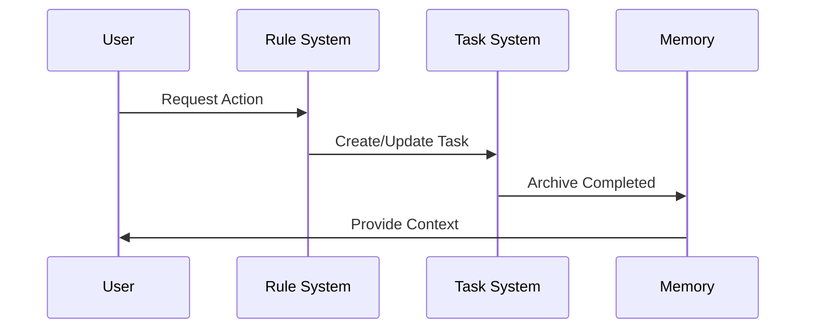
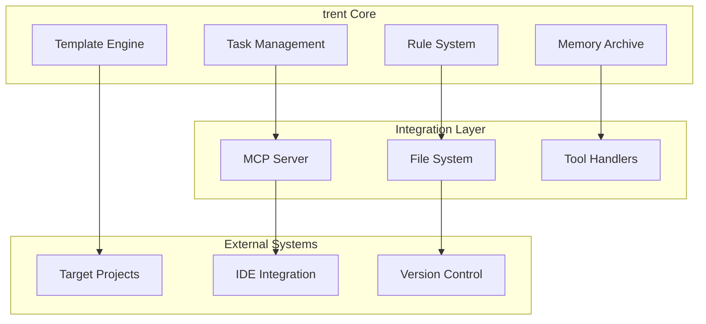

# Workflow Management System

This rule provides workflow management functionality including task expansion, methodology integration, and system visualization.

## Task Expansion System

### Complexity Assessment
**Purpose**: Automatically assess and expand tasks that are too complex for single execution.

### Complexity Scoring Criteria (1-10+ scale)
- **Estimated Effort (4 points)**: Task takes >2-3 developer days
- **Cross-Subsystem Impact (3 points)**: Affects multiple subsystems
- **Multiple Components (3 points)**: Changes across unrelated modules
- **High Uncertainty (2 points)**: Requirements unclear or unknown challenges
- **Multiple Outcomes (2 points)**: Several distinct, verifiable outcomes
- **Dependency Blocking (2 points)**: Large prerequisite for subsequent tasks
- **Numerous Criteria (1 point)**: Exceptionally long requirements
- **Story Points (1 point)**: Task assigned >5 story points

### Complexity Matrix
```
0-3 points  | Simple Task    | Proceed normally
4-6 points  | Moderate Task  | Consider expansion
7-10 points | Complex Task   | Expansion required (MANDATORY)
11+ points  | High Complex   | Must expand before creation
```

### Sub-Task Creation Process
**If complexity score ≥7, mandatory expansion required:**

1. **Sub-task Breakdown**: Define logical, sequential sub-goals
2. **Subsystem Alignment**: Align sub-tasks with subsystem boundaries
3. **Sub-Task Generation**: Create structured sub-task proposals
4. **Direct Execution**: Proceed with expansion without confirmation prompts

### Sub-Task File Format
**Filename**: `task{parent_id}-{sub_id}_descriptive_name.md`
**Example**: `task042-1_setup_database.md`, `task042-2_create_api.md`

**Note**: Use hyphens (not dots) to separate parent ID from sub-task ID. This matches the convention in core rules.

**YAML**:
```yaml
---
id: "42-1"              # String ID for sub-tasks (hyphen separator)
title: 'Setup Database'
type: task
status: pending
priority: high
parent_task: 42
dependencies: []        # Can depend on other tasks/sub-tasks
---
```

### Expansion Workflow
1. **Complexity Assessment**: Score task using established criteria
2. **Expansion Proposal**: Generate sub-task breakdown
3. **Direct Creation**: Create sub-tasks directly without approval prompts
4. **Sub-Task Creation**: Create individual task files
5. **Parent Task Update**: Update parent task to reference expansion

## Methodology Integration

### Sprint Planning
**Purpose**: Organize development work into manageable time-boxed periods.

### Sprint Creation Template
```yaml
# Sprint {number}: {sprint_name}
dates: {start_date} to {end_date}
capacity: {total_story_points}
goals: {2-3 primary objectives}

assigned_tasks:
  - task_id: {ID}
    title: {task_title}
    story_points: {1|2|3|5|8}
    status: pending

sprint_metrics:
  planned_points: {total}
  completed_points: {running_total}
  burn_rate: {points_per_day}
```

### Story Point Estimation Scale
- **1 SP**: Minor fixes, simple changes (< 1 hour)
- **2 SP**: Small features, straightforward tasks (1-4 hours)
- **3 SP**: Medium complexity, requires research (4-8 hours)
- **5 SP**: Complex features, multiple components (1-2 days)
- **8 SP**: Large tasks requiring expansion into sub-tasks

### Sprint Assignment Logic
1. **Capacity Planning**: Target 70% of estimated velocity for safety buffer
2. **Priority Mapping**: Critical/High priority tasks first
3. **Dependency Ordering**: Respect task dependencies within sprint
4. **Skill Balancing**: Mix of complex and simple tasks for flow

### Kanban Flow Management
**Purpose**: Track work flow and identify bottlenecks.

### Default WIP Limits
```yaml
wip_limits:
  pending: unlimited
  in_progress: 3
  review: 2
  testing: 2
  deployment: 1
  completed: unlimited
```

### Flow Metrics Tracking
- **Lead Time**: Total time from task creation to completion
- **Cycle Time**: Time from work start to completion
- **Throughput**: Tasks completed per time period
- **Flow Efficiency**: Active work time vs. total lead time

### Bottleneck Detection
- Tasks aging beyond normal cycle time
- Status columns exceeding WIP limits consistently
- Dependencies blocking multiple task flows
- Resource allocation imbalances

## System Visualization

### Workflow Diagrams
**Purpose**: Generate visual representations of task workflows and system relationships.

### Task Dependency Diagrams
```mermaid
graph TD
    T{task_id}["{task_title}"] --> T{dep_id}["{dep_title}"]
    T{task_id} --> |Priority: {priority}| T{dep_id2}["{dep_title2}"]
```

### System Architecture Overview


### Process Workflow Template


### Diagram Generation Triggers
- **Automatic Generation**: Task creation batch, system updates, documentation requests
- **Manual Generation**: Planning sessions, architecture reviews, onboarding, troubleshooting

### Architecture Visualization
**Purpose**: Provide clear architectural visualization of system components and relationships.

### Subsystem Analysis


### Data Flow Visualization


## Workflow Optimization

### Flow State Management
- **Smooth Flow**: Tasks moving predictably through pipeline
- **Blocked Flow**: Dependencies or resource constraints identified
- **Chaotic Flow**: WIP limits exceeded, context switching high
- **Optimized Flow**: Continuous delivery with minimal waste

### Continuous Improvement Triggers
- Weekly flow retrospectives based on metrics
- WIP limit adjustments based on team capacity
- Bottleneck elimination through process refinement
- Tool and automation opportunities identification

### Performance Optimization
- **Fast Detection**: Minimize time to detect issues
- **Efficient Resolution**: Optimize workflow algorithms
- **Resource Conservation**: Minimize resource usage during optimization
- **User Experience**: Maintain smooth user experience during changes

## Integration Points

### Task System Integration
- Task expansion integrated with task creation workflow
- Sprint planning coordinates with task assignment
- Flow metrics integrated with task completion tracking
- Workflow diagrams generated from task relationships

### Planning System Integration
- Sprint goals align with project milestones
- Flow optimization supports planning accuracy
- Methodology integration enhances planning effectiveness
- Visualization supports planning communication

### Quality System Integration
- Workflow metrics integrated with quality metrics
- Flow optimization supports quality improvement
- Methodology integration enhances quality processes
- Visualization supports quality communication

---

*This comprehensive workflow management system provides all necessary functionality for task expansion, methodology integration, and system visualization in a single, efficient rule.*