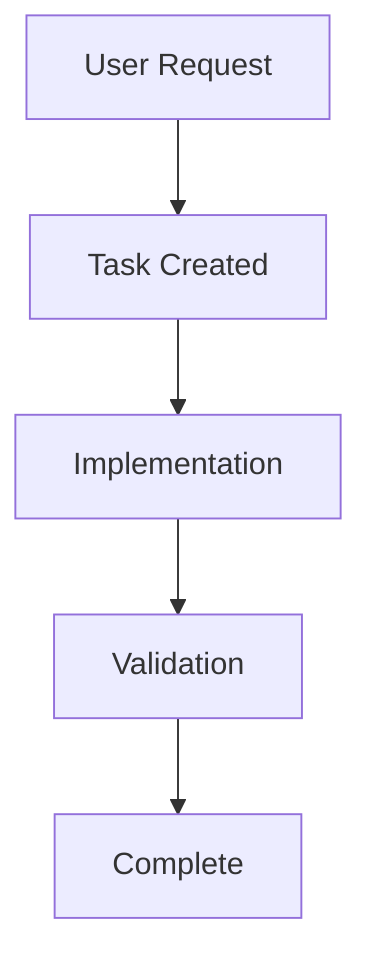

# trent Workflow Management

## Task Expansion

### Complexity Scoring (1-10+ scale)

- **Estimated Effort (4 pts)**: Task takes >2-3 developer days
- **Cross-Subsystem Impact (3 pts)**: Affects multiple subsystems
- **Multiple Components (3 pts)**: Changes across unrelated modules
- **High Uncertainty (2 pts)**: Requirements unclear
- **Multiple Outcomes (2 pts)**: Several distinct outcomes
- **Dependency Blocking (2 pts)**: Large prerequisite

### Complexity Matrix

| Score | Type | Action |
|-------|------|--------|
| 0-3 | Simple | Proceed normally |
| 4-6 | Moderate | Consider expansion |
| 7-10 | Complex | **MANDATORY expansion** |
| 11+ | High Complex | Must expand before creation |

### Sub-Task Format

Filename: `task{parent_id}-{sub_id}_name.md` (e.g., `task042-1_setup_database.md`)

```yaml
---
id: "42-1"
title: 'Setup Database'
status: pending
priority: high
parent_task: 42
dependencies: []
---
```

## Sprint Planning

### Story Point Scale

| Points | Effort |
|--------|--------|
| 1 SP | < 1 hour |
| 2 SP | 1-4 hours |
| 3 SP | 4-8 hours |
| 5 SP | 1-2 days |
| 8 SP | Large — must expand |

Target 70% of estimated velocity (safety buffer).

## Phase Completion Gate

Before starting Phase N+1:

1. **Verify Phase N Complete**: All tasks show `[✅]`
2. **Generate Phase SWOT Analysis**:

```markdown
# Phase {N} Completion Analysis

## Strengths: [What went well]
## Weaknesses: [Areas needing improvement, technical debt]
## Opportunities: [Improvements for next phase]
## Threats: [Risks, dependencies, security]

## Recommendation: [READY TO PROCEED / NEEDS REMEDIATION]

**Type "proceed" to continue to Phase {N+1}.**
```

3. **Wait for User Approval**
4. **Offer Git Commit** after approval

## Workflow Diagrams

Generate Mermaid diagrams for complex flows:



## Self-Improvement Protocol

When you identify issues with the trent system:

```markdown
## 🔧 Trent System Issue Detected

**Category**: [Inconsistency/Weak Enforcement/Missing Feature/Documentation Gap]
**Location**: [File and section]
**Issue**: [What's wrong]
**Proposed Solution**: [Specific fix]

**Options**:
1. ✅ Accept - Implement the fix
2. ❌ Decline - Keep current behavior
3. 🔄 Alternative - Different solution
```

## Project Context Display

At session start or task work, show:

```
📋 PROJECT CONTEXT
🎯 Mission: [Brief mission from PROJECT_CONTEXT.md]
📍 Current Phase: [Phase and focus area]
✅ Success Criteria: [Key objectives]
📊 Current Status: [Active tasks, progress, blockers]
```
