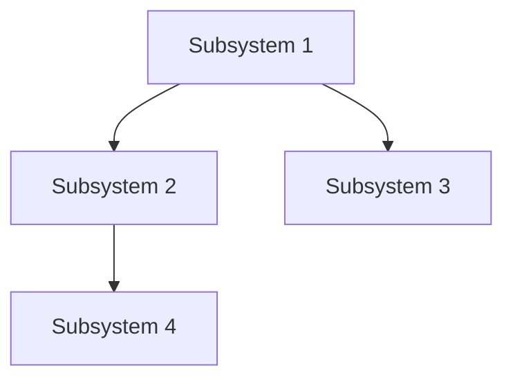

## Subsystems Registry

### Subsystems Overview
**Purpose**: Track and document the major components/modules of the project. Subsystems provide a high-level architectural view that helps with:
- Understanding system boundaries
- Identifying cross-cutting concerns
- Planning task impact analysis
- Onboarding new team members

**Location**: `.trent/SUBSYSTEMS.md` (single mandatory file)

### SUBSYSTEMS.md Template
```markdown
# Subsystems Registry

## Overview
[Brief description of how the project is organized into subsystems]

## Subsystem Index

| ID | Name | Type | Status | Owner |
|----|------|------|--------|-------|
| SS-01 | [Name] | [core/support/integration] | [active/deprecated/planned] | [team/person] |
| SS-02 | [Name] | [core/support/integration] | [active/deprecated/planned] | [team/person] |

---

## Detailed Subsystem Definitions

### SS-01: [Subsystem Name]

**Type**: core | support | integration
**Status**: active | deprecated | planned | in-development
**Owner**: [Team or person responsible]

#### Purpose
[2-3 sentences describing what this subsystem does and why it exists]

#### Key Components
- `path/to/component1/` - [Brief description]
- `path/to/component2/` - [Brief description]
- `filename.ext` - [Brief description]

#### Dependencies
- **Depends On**: [List of subsystem IDs this depends on, e.g., SS-02, SS-05]
- **Depended By**: [List of subsystem IDs that depend on this]

#### Interfaces
- **Inputs**: [What data/requests this subsystem accepts]
- **Outputs**: [What data/responses this subsystem produces]
- **APIs**: [Public APIs or entry points]

#### Technology Stack
- [Language/Framework 1]
- [Database/Storage]
- [External services]

#### Related Tasks
- Tasks that modify this subsystem should include `subsystems: [SS-01]` in YAML frontmatter

---

### SS-02: [Next Subsystem Name]
[Repeat structure for each subsystem]

---

## Subsystem Relationships

### Dependency Graph


### Cross-Cutting Concerns
| Concern | Affected Subsystems | Notes |
|---------|---------------------|-------|
| Logging | SS-01, SS-02, SS-03 | Centralized logging |
| Authentication | SS-01, SS-04 | Shared auth module |
| Error Handling | All | Standard error patterns |

---

## Maintenance Notes
- **Last Updated**: [Date]
- **Review Frequency**: [e.g., Monthly, Per Phase]
- **Update Triggers**: New subsystem added, major refactoring, architecture changes
```

### Subsystem Types
| Type | Description | Examples |
|------|-------------|----------|
| **core** | Essential business logic, primary functionality | Task Engine, Rule Processor |
| **support** | Infrastructure, utilities, cross-cutting services | Logging, Configuration, Utils |
| **integration** | External system connections, APIs | Database Connectors, MCP Tools |

### When to Update SUBSYSTEMS.md
- **New subsystem created**: Add entry immediately
- **Subsystem deprecated**: Update status, add deprecation notes
- **Architecture refactoring**: Update dependencies and relationships
- **Phase completion**: Review and validate subsystem documentation
- **Major feature addition**: Assess if new subsystem needed

### Task-Subsystem Integration
Tasks should reference affected subsystems in their YAML frontmatter:
```yaml
---
id: 42
title: 'Add caching to API layer'
subsystems: [SS-01, SS-03]  # Reference subsystem IDs
---
```

This enables:
- **Impact analysis**: Quickly identify which tasks affect which subsystems
- **Risk assessment**: Tasks touching multiple subsystems may need extra review
- **Planning**: Group related tasks by subsystem for focused sprints

### Auto-Discovery for Existing Projects
When initializing trent in an existing project, analyze the codebase to identify subsystems:

1. **Directory Analysis**: Major top-level directories often represent subsystems
2. **Package/Module Boundaries**: Language-specific module systems indicate boundaries
3. **Configuration Files**: Separate configs often indicate separate subsystems
4. **Database Schemas**: Distinct schema areas may map to subsystems
5. **API Routes**: Route groupings often align with subsystem boundaries

## Scope Validation

### Mandatory Scope Questions
Before creating any PRD, ask these essential questions:

1. **User Context & Deployment**
   - "Intended for personal use, small team, or broader deployment?"
   - Personal (1 user): Simple, file-based, minimal security
   - Small team (2-10): Basic sharing, simple user management  
   - Broader (10+): Full authentication, role management, scalability

2. **Security Requirements**
   - "Security expectations?"
   - Minimal: Basic validation, no authentication
   - Standard: User auth, session management, basic authorization
   - Enhanced: Role-based access, encryption, audit trails
   - Enterprise: SAML/SSO, compliance, advanced security

3. **Scalability Expectations**
   - "Performance and scalability expectations?"
   - Basic: Works for expected load, simple architecture
   - Moderate: Handles growth, some optimization
   - High: Speed-optimized, caching, efficient queries
   - Enterprise: Load balancing, clustering, horizontal scaling

4. **Feature Complexity**
   - "How much complexity comfortable with?"
   - Minimal: Core functionality, keep simple
   - Standard: Core plus reasonable conveniences
   - Feature-Rich: Comprehensive with advanced options
   - Enterprise: Full-featured with extensive configuration

5. **Integration Requirements**
   - "Integration needs?"
   - Standalone: No external integrations
   - Basic: File import/export, basic API
   - Standard: REST API, webhooks, common integrations
   - Enterprise: Comprehensive API, message queues, enterprise systems

### Over-Engineering Prevention
- **Authentication**: Don't add role permissions unless requested
- **Database**: Use simple file-based unless DB explicitly requested
- **API**: Don't add comprehensive REST beyond required
- **Architecture**: Default monolith unless scale requires separation
- **Shared Modules**: Plan shared utilities BEFORE feature work begins. Duplicated logic across features = scope failure. (See 04_code_reusability.md)
