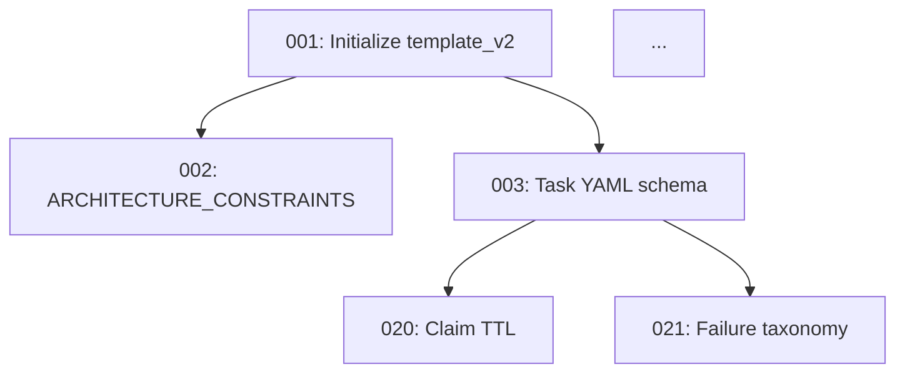

# Task 082: Create task dependency graph generation

## Objective
Add DEPENDENCY_GRAPH.md generation to the cleanup agent's nightly responsibilities in `template_v2/` — an auto-generated file showing task dependencies as both a Mermaid diagram and a text table.

## DEPENDENCY_GRAPH.md Format

```markdown
# Task Dependency Graph
<!-- AUTO-GENERATED by @trent-cleanup — DO NOT EDIT MANUALLY -->
**Generated**: {YYYY-MM-DD HH:MM UTC}
**Total Tasks**: {n} | **Dependency Chains**: {n} | **Blocked Tasks**: {n}

---

## Critical Path
Tasks that are blocking the most other tasks:
1. Task {ID}: {title} — blocking {n} tasks
2. Task {ID}: {title} — blocking {n} tasks

---

## Dependency Diagram



---

## Dependency Table

| Task | Title | Depends On | Blocks | Status |
|------|-------|-----------|--------|--------|
| 001 | Initialize template_v2 | — | 002, 003, 004... | [✅] |
| 003 | Task YAML schema | 001 | 020, 021, 024... | [📋] |
| 020 | Claim TTL | 003 | 043 | [📋] |

---

## Blocked Tasks (cannot start yet)

| Task | Title | Blocked By |
|------|-------|-----------|
| 042 | @trent-sprint spec | 040, 041, 043, 044 |
| 064 | platform_docs MCP tool | 061, 062, 100 |
```

## Cleanup Agent Addition

Add to task040 (@trent-cleanup) spec as additional responsibility:

```
After SPRINT.md generation:
7. Generate DEPENDENCY_GRAPH.md:
   a. Read all task YAML files — extract dependencies[] array
   b. Build adjacency list: task → [tasks it depends on] + [tasks that depend on it]
   c. Identify critical path: tasks with highest downstream dependency count
   d. Generate Mermaid diagram (compact — show only incomplete tasks)
   e. Generate dependency table (all tasks)
   f. Write to .trent/DEPENDENCY_GRAPH.md
   g. Add to git commit for cleanup run
```

## Acceptance Criteria
- [ ] `template_v2/.trent/DEPENDENCY_GRAPH.md` template created
- [ ] template has Mermaid diagram section + dependency table + critical path
- [ ] task040 (cleanup spec) updated with DEPENDENCY_GRAPH generation step (step 7)
- [ ] "AUTO-GENERATED" header present

## Verification Steps
- [ ] Template file exists
- [ ] Mermaid diagram section present
- [ ] Dependency table present
- [ ] task040 spec has step 7 referencing DEPENDENCY_GRAPH

## When Stuck
- Pure template + cleanup agent spec update task
- The Mermaid diagram section is key — visual dependency map helps humans at a glance
