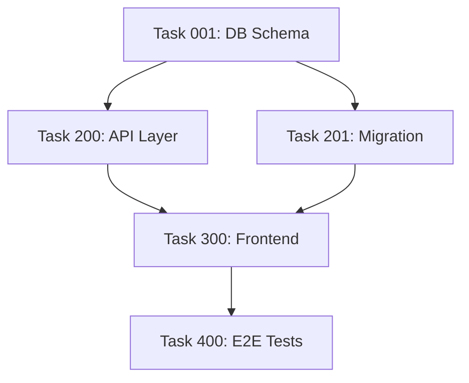

# Potential Changes to the Trent System
## Insights from Analyzing Large-Scale Projects

> **Context**: This document was created after analyzing G:\Maestro2\.trent — a project with
> 725+ tasks, 27+ phases, 3 cancelled phases, and multiple architectural pivots. The goal is
> to capture insights BEFORE moving on to a second (larger) project analysis, so findings
> compound rather than get lost to context resets.
>
> These are NOT fixes for the analyzed projects. These are changes to the trent SYSTEM itself
> to prevent these failure modes from occurring in future projects.

---

## The Core Failure Modes We Observed

### Failure Mode 1: "Schrödinger Task" — Completed Work Inside Cancelled Phases

**What happened in Maestro2**: Phase 14 (OpenClaw Wrapper Architecture) was cancelled.
It contained 47 tasks, many marked `completed`. Those tasks represent real work — real
decisions, real code written, real lessons learned. But the system has no way to distinguish:
- "This task was done and shipped" (completed + in-service)
- "This task was done but the whole approach was abandoned" (completed + harvested)

The current `cancelled` status on the parent phase doesn't propagate meaning to child tasks.
You end up with a TASKS.md where a task shows `[✅]` but the work is actually irrelevant
dead code. This corrupts the audit trail and confuses future context loads.

**The same pattern happened in Phases 11 and 16** — three cancelled phases in a row,
suggesting the project was in an exploratory period where the system was fighting the user
instead of supporting them.

### Failure Mode 2: Context Reset = Constraint Amnesia

**What happened in Maestro2**: The user created `ARCHITECTURE_CONSTRAINTS.md` — a file
that doesn't exist in any trent template. They created it because the AI kept suggesting
things that violated hard architectural rules (Docker-first, Electron-only local). Phase 14
was cancelled specifically because the AI suggested wrapper architecture that ran services
on the host machine, violating Constraint 1.

The AI read the constraint file when creating infrastructure tasks, but NOT at session start.
So every new session started with architectural amnesia. The user had to keep re-stating
"no, we're Docker-first" repeatedly across sessions.

**The existing `PROJECT_CONTEXT.md` and `PROJECT_GOALS.md` have the same problem** — they
exist but there's no enforcement mechanism ensuring they're loaded at session start.

### Failure Mode 3: Phase Numbers Broke as a Namespace

**What happened in Maestro2**: The task YAML `phase:` field shows both `6` AND `maestro-6`,
both `8` AND `maestro-8`, etc. This means mid-project, the numbering convention collided
and someone added a prefix to disambiguate. The system has no defense against this — phase
numbers are just integers in YAML, and when you cancel+replace a phase, the replacement
has to either reuse the number (confusing) or skip ahead (leaving gaps).

Additionally, Phase 17 had 93 tasks — "Maestro Platform Improvements" became a junk drawer
for everything that didn't fit cleanly. This is a **categorization pressure valve failure**:
when a task doesn't obviously belong to a phase, it gets dumped in the catch-all mega-phase.

### Failure Mode 4: TASKS.md Becomes a Non-Human-Readable Search Index

At 725+ tasks, TASKS.md is 840+ lines and nobody reads it sequentially anymore. But the
system is designed around the assumption that TASKS.md is the living working view of the
project. It's being used as an append-only log, but it doesn't have the structure for that.

The result: agents try to maintain sync between TASKS.md and 725 individual task files,
which is mechanical toil that adds no value. The sync enforcement rules (which are good
at small scale) become a drag on large projects.

### Failure Mode 5: Phases Mix Two Different Concepts

In Maestro2, phases are simultaneously:
1. **Temporal milestones** ("Phase 21: Stream-Ready Sprint" — a delivery target)
2. **Architectural experiments** ("Phase 14: Wrapper Architecture" — a hypothesis)
3. **Feature groupings** ("Phase 10: 3D Visual Overhaul" — a domain)
4. **Catch-all buckets** ("Phase 17: Platform Improvements" — everything else)

These are four different things. Putting them all in one `phase:` field means the system
can't distinguish a failed hypothesis from a delivered milestone from an ongoing domain.

---

## User's Ideas (from conversation)

1. **Change from phases to subsystems as the primary organizing dimension**
   - Instead of "task belongs to Phase 20", use "task belongs to subsystem: theme-db"
   - Subsystems are stable (they map to the codebase architecture, which doesn't change
     much), whereas phases are temporal and get cancelled/renumbered
   - The user noticed this when looking at their own SUBSYSTEMS.md and realizing it
     already described the real organizing principles of the project

2. **Phases have not worked out as ideally as hoped in practice**
   - The user said this explicitly: "phases rarely are working out as ideally as we had hoped"
   - The observation came from a project with 27+ phases, many cancelled, and 725 tasks
     spread unevenly (some phases have 4 tasks, one has 93)

---

## AI's Ideas (Gilfoyle's Diagnosis)

### Idea A: Two-Axis Organization (What + When)

**Problem it solves**: Phases try to do too many things at once.

**Proposed model**:
```
subsystem: theme-db        ← WHERE in the code (stable, maps to codebase)
concern: data-migration    ← WHAT kind of work (feature, bug, refactor, experiment)
milestone: stream-ready    ← WHEN it matters (delivery target, not architectural)
```

A task lives at the intersection of all three. The `phase:` field becomes `milestone:` —
lighter weight, explicitly temporal, and not the primary organizing key.

This is additive — existing tasks keep their `phase:` field as legacy, new tasks get
`subsystem:` + `milestone:` going forward. No mass renumbering.

### Idea B: First-Class "Harvested" Status for Abandoned-But-Learned Work

**Problem it solves**: Schrödinger Tasks — completed work inside cancelled phases.

**Proposed addition to task status**:
```
status: harvested
```

Meaning: "We did this work. We learned from it. The deliverable didn't ship but the knowledge
did. This is reference material, not dead code." This is distinct from `cancelled` (we decided
not to do this) and from `completed` (this shipped and is in service).

When a phase is cancelled, the AI should offer: "Sweep phase tasks — mark delivered tasks
as `harvested`, unstarted tasks as `cancelled`." This preserves audit trail without creating
the logical contradiction of `completed` inside `cancelled`.

### Idea C: Architecture Constraints as a First-Class Trent File

**Problem it solves**: Constraint amnesia — the AI forgetting hard rules between sessions.

**Proposed addition to trent template**:
```
.trent/
├── ARCHITECTURE_CONSTRAINTS.md   ← NEW: non-negotiable rules, always loaded at session start
```

**Format**:
```markdown
# ARCHITECTURE_CONSTRAINTS.md
> ALWAYS load this file at session start. These are non-negotiable.

## Constraint 1: [Name]
**Non-negotiable**: Yes / Can be overridden by user with explicit approval
**Rationale**: Why this constraint exists
**Violation examples**: Specific things the AI should never suggest
**Change authority**: User-only, requires explicit approval logged in Change Log
```

The session start protocol (25_trent_index.mdc) should explicitly include:
"If ARCHITECTURE_CONSTRAINTS.md exists, load it and display constraint summary."

### Idea D: Split TASKS.md into Two Artifacts at Scale

**Problem it solves**: TASKS.md becomes unreadable at 500+ tasks.

**Proposed split** (triggered when TASKS.md exceeds ~400 lines or 200 tasks):

1. **`SPRINT.md`** — What are we doing RIGHT NOW (10-20 tasks max, current sprint only)
   This is the working view. Agents read this first. Small, fast, always current.

2. **`TASKS.md`** — Becomes a subsystem-organized index, not a flat list.
   Headers by subsystem, not by phase. Tasks listed with status only (no detail).
   Phase info becomes a tag, not a section header.

3. **`CHANGELOG.md`** — All completed tasks (compressed). One line per task:
   `[2026-02-10] task1400: OpenClaw Docker isolation - completed (phase 14, harvested)`
   This is the audit log. Nobody reads it except when debugging history.

The SPRINT.md concept is the most important — at large scale, the question "what are we
doing right now?" should be answerable in one file read, not by scanning 840 lines.

### Idea E: Subsystem-Prefixed Task IDs to Prevent Namespace Collision

**Problem it solves**: Phase number collisions (maestro-6 vs 6), ID reuse confusion.

**Proposed convention** (optional, for large projects):
```
TDB-001   Theme Database
ANI-042   Animation
AUTH-013  Authentication
3D-007    3D / React Three Fiber
GW-005    Gateway / OpenClaw integration
```

These never collide because they're anchored to the subsystem, not the phase. Phase 14
getting cancelled doesn't affect ANI-042 — it just gets `milestone: harvested`.

Backward compatible — existing `task001_name.md` format stays. New projects can opt into
subsystem-prefixed IDs. The `id:` field in YAML can hold either format.

### Idea F: Phase "Purpose Type" to Prevent Junk-Drawer Phases

**Problem it solves**: Mega-phases like "Phase 17: Platform Improvements" (93 tasks).

**Proposed addition to phase YAML**:
```yaml
purpose: milestone | experiment | domain | maintenance
```

- `milestone`: A delivery target (stream-ready, beta launch, etc.)
- `experiment`: A hypothesis being tested (wrapper architecture, deep-merge, etc.)
- `domain`: A feature area (3D overhaul, theme platform, etc.)
- `maintenance`: Ongoing improvements (bug fixes, refactors, tech debt)

When `purpose: experiment`, the phase gets a **hypothesis field**:
```yaml
hypothesis: 'Wrapper architecture will allow OpenClaw integration without tight coupling'
outcome: cancelled
outcome_reason: 'Violated Docker-first constraint. 45 tasks preserved as harvest reference.'
```

This makes it explicit that the phase was testing an idea, not shipping a feature. When
cancelled, the system prompts: "Experimental phase cancelled. Document outcome and sweep
tasks to `harvested`/`cancelled` as appropriate."

### Idea G: TASKS.md Headers Should Be Subsystems, Not Phases (for large projects)

**Problem it solves**: Phases as section headers create an unstable table of contents
that gets invalidated every time a phase is added, cancelled, or renumbered.

**Proposed reorganization** (for projects >200 tasks):

Instead of:
```markdown
## Phase 8: OpenClaw Integration [✅]
- [✅] task0800: ...
## Phase 14: Wrapper Architecture [❌]
- [✅] task1400: ... (completed but abandoned)
```

Use:
```markdown
## Subsystem: openclaw-integration
### Milestone: initial-integration [✅ Phase 8]
- [✅] task0800: ...
### Milestone: wrapper-experiment [❌ Phase 14 - harvested]
- [🌾] task1400: ... (harvested - approach abandoned)
```

Subsystem headers don't change. Milestone sub-headers can be added/cancelled freely.
A harvested task gets 🌾 as a distinct visual indicator (or `[H]` for Windows-safe).

### Idea H: Session Start Must Load Hard Constraints, Not Just Status

**Problem it solves**: The current session start protocol loads task status but not
architectural constraints. This means a new session can propose things that violate
hard-won architectural decisions from previous sessions.

**Proposed change to 25_trent_index.mdc session start**:

Current:
```
📌 SESSION CONTEXT
Mission: [from PROJECT_CONTEXT.md, 1 line]
Goals: G-01 | G-02 (from PROJECT_GOALS.md)
Phase: [current phase]
```

Proposed addition:
```
📌 SESSION CONTEXT
Mission: [from PROJECT_CONTEXT.md, 1 line]
Goals: G-01 | G-02 (from PROJECT_GOALS.md)
Phase/Sprint: [current phase or SPRINT.md summary]
⚠️ CONSTRAINTS: [from ARCHITECTURE_CONSTRAINTS.md — list constraint names only]
  → Full constraints: .trent/ARCHITECTURE_CONSTRAINTS.md (read before infra tasks)
Ideas: [N] active (from IDEA_BOARD.md)
```

Just showing constraint *names* at session start is enough to trigger memory. The AI
doesn't need to load the full file — it just needs a reminder that constraints exist
and what they're called, so it knows to read the file before suggesting architecture changes.

---

## Summary: Priority Order for trent System Changes

Based on impact vs. implementation effort:

| Priority | Change | Effort | Impact |
|----------|--------|--------|--------|
| 1 | `ARCHITECTURE_CONSTRAINTS.md` template + session start load (Idea C + H) | Low | High |
| 2 | `status: harvested` for abandoned-but-learned work (Idea B) | Low | High |
| 3 | `SPRINT.md` as the active working view (Idea D) | Medium | High |
| 4 | Phase `purpose:` type field to prevent junk-drawer phases (Idea F) | Low | Medium |
| 5 | Phase `hypothesis:` + `outcome:` fields for experimental phases (Idea F) | Low | Medium |
| 6 | Two-axis organization: `subsystem:` + `milestone:` tags (Idea A) | Medium | Medium |
| 7 | TASKS.md subsystem-header reorganization for large projects (Idea G) | High | Medium |
| 8 | Subsystem-prefixed task IDs (Idea E) | Medium | Low |

---

## What NOT To Do (Learned from Analysis)

- **Do NOT mass-renumber existing tasks** — cosmetic fix, enormous effort, zero gain
- **Do NOT require a full system rewrite** to accommodate large projects — changes must
  be additive and backward compatible
- **Do NOT remove phases entirely** — phases-as-milestones is genuinely useful.
  Only phases-as-namespaces is broken.
- **Do NOT add more sync enforcement rules** — at large scale, sync enforcement becomes
  toil. The answer is better artifact design (SPRINT.md), not more validation.

---

## Open Questions for the Next Project Analysis

1. Does the second project (20 AI model attempts, research-oriented) show a different
   failure mode? Hypothesis: research projects need "experiment branches" not phases,
   because the work is iterative hypothesis-testing, not milestone-to-milestone delivery.

2. Is the "harvested" status enough, or do we need a full "experiment" task type with
   hypothesis/outcome fields at the task level (not just the phase level)?

3. At what task count does TASKS.md become a liability vs. an asset? Maestro2 hit it
   around 400-500. Is there a natural threshold to build into the system?

4. The `ARCHITECTURE_CONSTRAINTS.md` in Maestro2 was user-created out of necessity.
   Should trent proactively prompt for this file during `@trent-setup`?
   "Do you have any non-negotiable architectural constraints? (Docker-first, no cloud, etc.)"

---

*Last updated: 2026-03-04 — after analysis of G:\Maestro2\.trent (725+ tasks, 27 phases)*
*Next: Analyze second project (VisionLang POC sequence) — see section below*

---

---

## Part 2: VisionLang POC Sequence (poc016 → poc020)
## Insights from Sequential Experiment Projects

> **Context**: Analyzed a series of research POC (Proof of Concept) experiments for "VisionLang" —
> a revolutionary AI compression technology using visual glyph encoding. These experiments ran from
> approximately November–December 2025 across two drives and folder name changes:
>
> | POC | Path | Task System | Dates |
> |-----|------|-------------|-------|
> | poc016 | P:\experiments\poc016_universal_coverage | None (free-form) | 2025-11-14 |
> | poc017 | P:\experiments\poc017_organized | None (MASTER_PLAN.md only) | 2025-11-17 |
> | poc018 | P:\experiments\poc018_streamlined | .fstrent_spec_tasks | 2025-11-21 |
> | poc019 | P:\hieroglyphics\experiments\poc019 | .fstrent_spec_tasks | 2025-11-25 |
> | poc020 | P:\hieroglyphics\experiments\poc020 | .fstrent_spec_tasks | 2025-12-15 |
>
> CRITICAL: These are read-only reference. Do NOT modify anything in these folders.

---

## What This Project IS

VisionLang replaces traditional text tokenization with purpose-built visual symbols ("glyphs") —
6x6 pixel grids with line-based patterns that encode semantic meaning. The claim is 24-32x
compression over standard LLM tokenization, enabling local AI inference on consumer hardware
(RTX 4090). A provisional patent was filed November 9, 2025.

The core system is a pipeline: vocabulary extraction → glyph rendering → vision encoder training
(ResNet-18) → corpus generation → language model training (EmbeddingTransformer) → demo.

Each POC was a fresh attempt at getting this pipeline to complete successfully. None completed
the full pipeline. Most stalled at phases 5-6 (corpus generation or LM training).

---

## The Failure Pattern: Different From Maestro2

### This Is NOT a Phase Categorization Problem

Unlike Maestro2, this project doesn't have a "junk drawer phase" problem. The phases are actually
quite clean and stable across every POC: Phase 0 (setup), Phase 1 (vocabulary), Phase 2 (tiers),
Phase 3 (glyph rendering), Phase 4 (vision encoder), Phase 5 (encoder/decoder), Phase 6 (corpus),
Phase 7 (language model), Phase 8 (demo). Same phases, every time, poc016 through poc020.

**The phases aren't the problem. The phases are the one thing that works.**

### The Actual Failure Mode: "Fresh Start" Carries the Same Structural Errors Forward

**What happened**: Each POC was a fresh start that claimed to incorporate lessons from the
previous POC. The handoff documents (POC018_TASK_REFINEMENT_SUMMARY.md, POC019_PREFLIGHT_CHECKLIST.md,
FUTURE_ENHANCEMENTS.md) are actually excellent — detailed, specific, honest about what failed.

But looking at the actual task data:

- **poc017**: No trent system. Used MASTER_PLAN.md only. Prereqs failed on first run (missing
  data directories). The experiment log shows: "EXPERIMENT FAILED — Prerequisites not met".
  The lesson captured: "need better environment verification". Response: Added a PREFLIGHT
  CHECKLIST in poc019. But the prerequisite failure wasn't a checklist problem — it was
  that the data sources weren't staged before starting.

- **poc018**: Stalled at Phase 6. TASKS.md says "72% complete - phases 0-5 done, ready for
  Phase 6 corpus generation." Phase 6 was 0/7 tasks with status `[📋]` — scripts created,
  ready to execute. But execution never happened. Why? The corpus generation requires ~90GB
  of storage and 12-18 hours of compute. This is a **resource gate** that trent has no way
  to model.

- **poc019**: Added MySQL database (this is a significant architectural shift from JSON files).
  Got a "MAJOR REPLAN" in December: data quality issues with contractions, POS tags, collation.
  The TASKS.md grew to 53KB (poc018 was 33KB). The project had a crash, then recovery.
  Stalled ~20% complete.

- **poc020**: Deliberately scoped down — English only, strip multilingual complexity, prove
  core technology works. This is the RIGHT strategic response to repeated failure. But even
  here, stalled at Phase 3 (glyph generation) — scripts created but not yet executed for
  batch generation.

### The Real Pattern: Tasks Plan → Scripts Ready → Execution Blocked

Every POC follows this pattern:
```
Phase 0: Complete
Phase 1: Complete  
Phase 2: Complete
Phase 3: Scripts created, partial execution
Phase 4: Scripts created, not executed
Phase 5: Scripts created, not executed
Phase 6: Scripts created, not executed
Phase 7: Scripts created, not executed
```

The trent system diligently tracks "scripts created" as `[📋]` (ready). But "scripts ready"
is not the same as "scripts executed successfully." The system has no visibility into why
execution stopped. The task goes from `[📋]` → nothing. There's no "execution was attempted
but failed due to resource constraints" status.

### The Three Execution Blockers (None Modeled in Trent)

From reading the POC data, execution stopped for one of three reasons each time:

1. **Resource Gate**: "Phase 6 corpus generation requires ~90GB storage, 12-18 hours compute"
   — You can't just run this. You need the right hardware/storage moment. The task system
   has no concept of a resource-gated task. It just shows `[📋]` indefinitely.

2. **Data Quality Gate**: poc019's MAJOR REPLAN happened because the vocabulary data had
   structural errors (contraction splitting, POS tag mixing, collation bugs). The system
   had tasks marked complete that produced invalid data. Downstream tasks couldn't run
   against invalid input. The system had no way to propagate "upstream data quality fail"
   down through dependent tasks.

3. **Scope Pivot**: Each POC is itself a scope pivot in response to the previous failure.
   poc018 → poc019 added 5 languages. poc019 → poc020 stripped back to English only.
   But there's no trent-level concept of "this POC is an experiment branch."
   The poc020 FUTURE_ENHANCEMENTS.md tracks what got deferred, but it's a manual artifact
   not integrated with the task system.

---

## The Structural Observation: Research Projects vs. Delivery Projects

This is the most important insight from this analysis:

**Maestro2 is a delivery project.** It has an architecture, it ships features, it has phases
that accumulate into a product. The failure mode was categorization confusion and constraint amnesia.

**VisionLang is a research project.** It has a hypothesis (24x compression works), and each
POC is an experiment to validate a piece of that hypothesis. The failure mode is that a delivery-
oriented task system (phases, tasks, completion gates) is being used to manage hypothesis-testing
work. These are fundamentally different workflows.

In a research project, "failure" is data. A task that ran and produced bad output is MORE
valuable than a task that never ran — because it tells you something about the hypothesis.
The current trent system can't express this. A failed task is either `[✅]` (pretend it worked)
or `[❌]` (cancelled, as if we never wanted to do it). Neither captures "we ran it, got a result,
and the result changed our understanding."

---

## AI's Ideas for the Research/Experiment Workflow

### Idea I: First-Class "Experiment" Project Type

**Problem it solves**: Using a delivery task system for research/hypothesis-testing work.

**Proposed addition**: `@trent-setup` should ask: "Is this project a delivery project or
a research/experiment project?" The answer changes several default behaviors:

| Behavior | Delivery Project | Research Project |
|----------|-----------------|------------------|
| Phase purpose | Milestone delivery | Hypothesis validation |
| Task failure | Bad, needs fixing | Expected, is data |
| Status: failed | Problem to resolve | Result to learn from |
| TASKS.md | Current work tracker | Experiment log |
| Session start | "What are we building?" | "What are we testing?" |
| PLAN.md | PRD with acceptance criteria | Hypothesis + experiment design |

For research projects, trent should generate a different set of template files:
- `HYPOTHESIS.md` instead of (or alongside) PLAN.md
- `EXPERIMENT_LOG.md` (auto-appended, never overwritten)
- `FINDINGS.md` (AI-assisted synthesis of completed experiments)

### Idea J: Resource-Gated Task Status

**Problem it solves**: Tasks stuck at `[📋]` indefinitely because they need hardware,
storage, or time that isn't currently available.

**Proposed new status**:
```
[⏳] = Resource-Gated (ready to execute but blocked on external resource)
```

**Task YAML addition**:
```yaml
resource_requirements:
  storage_gb: 90
  compute_hours: 12-18
  vram_gb: 8
  requires: [gpu, large_storage]
gate_status: waiting_for_resources
gate_note: "Need to confirm 90GB free on P drive before starting corpus generation"
```

This makes the block visible in TASKS.md instead of invisible. A `[⏳]` task is not
the same as a `[📋]` task — it's deliberately parked until resources are available.

### Idea K: Data Quality Propagation (Upstream Failure → Downstream Warning)

**Problem it solves**: poc019's MAJOR REPLAN — tasks completed with bad output, downstream
tasks blocked because they depend on invalid data.

**Proposed mechanism**: Tasks can declare `data_outputs` and `data_inputs`. When a task
is marked `[❌]` or gets a `quality_flag`, the system automatically flags dependent tasks:

```yaml
# In completed task:
data_outputs:
  - file: v3_english_lemmas_final.json
    quality: degraded
    quality_reason: "Contraction splitting bug - 'don't' → 'don' + 't'"
```

When this quality flag is set, any task with `data_inputs: [v3_english_lemmas_final.json]`
gets automatically flagged with a warning:
```
[📋⚠️] Task 201: Generate Tier 1 Semantic Cores
         WARNING: Input data v3_english_lemmas_final.json has quality flag
```

This is the difference between a task system that tracks completion and one that
tracks quality propagation through data dependencies.

### Idea L: POC/Experiment Branching in the Task System

**Problem it solves**: Each POC is a new project, but they share lineage. Knowledge from
poc018 should automatically flow to poc019. Currently this is manual (copy files, update
references, create handoff docs).

**Proposed addition**: `@trent-setup --branch-from <path>` creates a new project that:
1. Copies the task structure from the source project
2. Marks all tasks as `[📋]` (fresh start, but structure preserved)
3. Creates an `INHERITED_FROM.md` documenting what was kept/changed
4. Runs the diff automatically: "These 12 tasks are identical to poc018, these 5 were modified"

This makes the lineage explicit and machine-readable rather than embedded in ad-hoc
handoff documents that only humans can parse.

### Idea M: Experiment Outcomes as First-Class Data

**Problem it solves**: The FUTURE_ENHANCEMENTS.md and lessons-learned documents are
excellent human artifacts but not integrated with the task system.

**Proposed addition**: When completing a POC/experiment phase, the AI prompts:
```
Phase 4 (Vision Encoder) complete. What was the outcome?
1. ✅ Hypothesis validated — move to next phase
2. ⚠️ Partially validated — continue with caveats (specify)
3. ❌ Hypothesis invalidated — pivot required
4. 🔄 Inconclusive — need more data/experiments
```

The answer gets stored in the phase file:
```yaml
outcome: partially_validated
outcome_note: "97.8% accuracy achieved (target was 99.5%). Acceptable for POC, not for production."
outcome_date: "2025-11-24"
next_action: proceed_with_caveat
```

This makes experiment outcomes queryable. You could ask trent: "What phase outcomes have
been partial in this project?" and get a list, rather than hunting through handoff documents.

### Idea N: SPRINT.md for Research = EXPERIMENT.md

**Problem it solves**: In research projects, "what are we doing right now?" is not
"which tasks in the current phase" but "which hypothesis are we currently testing."

For research projects, the SPRINT.md equivalent is `EXPERIMENT.md`:
```markdown
# Current Experiment

## Hypothesis
ResNet-18 with 512-dim embeddings can achieve >99% accuracy on 261K glyph classification.

## What We're Running
- Task 401: Train vision encoder (20-25 min estimated)
- Task 402: Extract embeddings for all glyphs

## Success Criteria
- Train accuracy: >99.5%
- VRAM: <5GB
- Time: <40 minutes

## If It Fails
- Check batch size (try 512 → 256)
- Check learning rate (try 1e-3 → 5e-4)
- Fallback: Accept 97%+ for POC, document delta

## Status: RUNNING
## Started: 2025-11-23 14:00
## Resource estimate: 3-4GB VRAM, 20-25 minutes
```

---

## Comparison: Maestro2 vs VisionLang Failure Modes

| Dimension | Maestro2 | VisionLang POCs |
|-----------|----------|-----------------|
| Project type | Delivery (build a product) | Research (prove a hypothesis) |
| Phase structure | Chaotic — 27 phases, 3 cancelled, junk-drawer | Clean — same 8 phases every POC |
| Primary failure | Categorization confusion + constraint amnesia | Execution never happened despite planning |
| Task system role | Too much organizational overhead | Wrong tool for the job (delivery system for research) |
| Context amnesia | AI forgot architectural constraints | AI forgot why previous POC failed |
| "Stuck" pattern | Tasks in wrong phase, tasks in cancelled phases | Tasks planned but execution blocked invisibly |
| Knowledge transfer | Almost none (each session starts cold) | Some (handoff docs created manually) |
| What was missing | ARCHITECTURE_CONSTRAINTS.md + SPRINT.md | EXPERIMENT.md + resource-gated tasks |

---

## Summary: Additional Priority Changes for Trent System

Based on VisionLang POC analysis, these additions complement the Maestro2 findings:

| Priority | Change | Effort | Impact |
|----------|--------|--------|--------|
| 9 | Project type question at `@trent-setup` (delivery vs. research) | Low | High |
| 10 | `[⏳]` Resource-Gated task status | Low | Medium |
| 11 | `EXPERIMENT.md` template for research projects | Low | High |
| 12 | Data quality propagation (upstream fail → downstream warning) | High | Medium |
| 13 | `@trent-setup --branch-from` for POC lineage | Medium | Medium |
| 14 | Experiment outcome recording in phase YAML | Low | Medium |

---

## Open Questions After Both Project Analyses

1. **The fundamental question**: Should trent be one system that handles both delivery and
   research projects, or should it fork into two modes? The failure modes are so different
   that trying to serve both with one rule set may produce a system that does neither well.

2. **Context transfer**: Both projects suffered from context amnesia between sessions. The
   memory system we built (memory_capture_session, memory_search) is the right architectural
   response — but are we actually using it? Were these projects using it? If not, why not?

3. **The execution gap**: In VisionLang, the gap is always between "scripts created" and
   "scripts executed." This is a trent visibility problem — we track planning artifacts
   but not execution evidence. Should task completion require attaching execution output
   (logs, metrics) rather than just marking `[✅]`?

4. **Hypothesis vs. story**: Delivery projects track "user stories" (as a user, I want X).
   Research projects track "hypotheses" (if we do X, we expect Y). These need different
   template structures. Should trent's `@trent-plan` ask which type before generating PLAN.md?

---

*Last updated: 2026-03-04 — after analysis of VisionLang poc016-poc020*
*Projects analyzed: G:\Maestro2 (delivery, 725 tasks) + P:\experiments/P:\hieroglyphics poc016-020 (research)*

---

---

## Part 3: The Autonomous Multi-Agent Future
## Designing Trent for Agents Working Without a Human Present

> **Context**: This section captures the strategic vision and specific design requirements
> for trent's next evolution — moving from a human-supervised task system to one that
> supports autonomous agents working on schedule (cron jobs, 2-hour sprints, midnight
> cleanup runs) without the developer at the keyboard.
>
> **The real situation**: Solo developer, $3-4K/month AI spend, 50-120 hour weeks, racing
> China on a billion-dollar compression technology (VisionLang), maintaining Maestro2 for
> income, and needing the automation layer to multiply output without multiplying hours.
> This isn't a nice-to-have — it's a survival requirement.
>
> **The meta-observation**: trent_rules IS a VisionLang-style experiment. Every version
> is a POC. This document is the lessons-learned handoff from one POC to the next. The
> system should eventually be self-improving — logging its own failures and ideas the way
> these projects log theirs.

---

## The Leverage Problem (Why Autonomous Agents Matter)

Every hour spent supervising an AI that could be working independently is wasted leverage.
The goal is:

```
Midnight: Cleanup agent analyzes all tracked projects
          - Reviews task status, cleans orphans/phantoms
          - Performs SWOT analysis on each project
          - Curates and re-prioritizes task list
          - Commits findings to .trent/

Every 2 hours: Task agents spin up on each project
               - Claim available tasks (atomic git commit)
               - Execute work in isolated worktrees
               - Run tests, verify output
               - Commit results or escalate failures

Human role: Approve architectural decisions, review escalations,
            set task safety flags, unblock resource gates
```

The .trent folder, TASKS.md, the rules, and the skills are the ONLY coordination layer
available to agents that don't share memory. Everything these agents need to know must
be readable from those files.

---

## User's Ideas (from conversation, 2026-03-04)

### U1: Executable Acceptance Criteria (Tests as First-Class)
Tasks come back broken — sometimes not even compiling. The fix: acceptance criteria
must be *executable*, not just a checklist. A test script that the agent runs against
its own output before marking done. The task cannot be marked `[✅]` without attaching
evidence of passing tests.

### U2: Escalation Ladder (Local LLM → Paid Model → Human)
Start cheap. Use a local/free LLM first. If it fails, escalate to a better (more expensive)
model. If it fails again, escalate to human review. This prevents runaway costs on tasks
that require judgment while keeping simple tasks cheap.

### U3: Ralph Wiggum Loop Prevention
The pattern: AI confidently produces wrong output → corrected → produces same wrong output
again → repeat indefinitely. (Named after the Simpsons character who confidently says
wrong things without learning.)
Ref: Search "Ralph Wiggum loop AI" for context.
Fix: After N failed attempts, the retry must include the failure log AND explicit instruction
to research alternative approaches rather than retrying the same approach.

### U4: Race Condition Handling for Parallel Agents
The `[📋]` (speccing) and `[🔄]` (in progress) statuses already anticipate this.
The task *claim* needs to be atomic — a git commit that says "agent X is working on
task 042" so no two agents grab the same task simultaneously. Worktrees provide isolation;
git commits provide the atomic claim.

### U5: Task Safety Flag (AI-safe vs. Human-required)
Some tasks are safe for an agent to attempt autonomously. Others require human judgment.
Add a flag: `ai_safe: true/false`. Agents in scheduled (unattended) mode only pick up
`ai_safe: true` tasks. Tasks without the flag default to requiring human presence.

### U6: Subsystems Over Phases as Primary Organizing Dimension
Keep phases for milestones but add `subsystem:` as the primary organizing field in task
YAML. Don't redesign TASKS.md yet — just add the field. Reorganization of TASKS.md
headers around subsystems is the *next* version's work.

### U7: Spec Freshness — Tasks That Research Before They Build
A task written 3 weeks ago may reference an API that changed, a library that was superseded,
or an approach that a new technology made obsolete. Agents executing old tasks should have
permission — actually a mandate — to verify the spec is still current before implementing.
Add: `spec_freshness: { verified_date, allow_spec_update: bool }`. If outdated, agent
updates spec + commits it before writing code.

### U8: PLAN.md → PRD.md Rename
"PRD" (Product Requirements Document) is current standard terminology for spec-driven
development. PLAN.md is a trent-specific term that doesn't communicate to new agents or
collaborators what the file is. Simple rename, big clarity gain.  If there are any other 
standard naming conventions for other files, that I am breaking... please rename them 
appropriately.

### U9: Git History as Agent Context
Every agent spawned on a task should run `git log --oneline -20` before starting. Recent
commit history tells the agent what was last attempted, whether it failed, and what changed.
This is free context currently thrown away. Add to the pre-task checklist.

### U10: More Frequent Git Commits (Enforced)
Commits should happen at every task state transition, not just at completion. Draft work,
in-progress checkpoints, test results — all committed. This gives agents (and humans) a
recoverable history and prevents large uncommitted change sets that are hard to audit.

### U11: Self-Evolving System / AI IDEA_BOARD Contributions
The trent system should eventually log its own failure patterns and improvement ideas,
not just the project's. The IDEA_BOARD should accept AI-generated entries (clearly labeled)
that the human can choose to promote to tasks. The self-improvement rules (27_trent_self_improvement)
are the seed of this — expand them so the AI actively contributes to its own evolution.

### U12: Database-Driven Future Version (Deferred — After Maestro2)
The next-next version of trent will be database-driven. Agents get only the files relevant
to their specific task (huge context savings). The file-based system is the correct
intermediate step — get the concepts right here first, then port cleanly. The file-based
system has one critical advantage the database version won't: every AI tool reads markdown
natively without an API layer.

### U13: Multiple Agents in Git Worktrees
Multiple agents working on different tasks simultaneously, each in an isolated worktree
branch. The .trent folder is the coordination layer — agents read it to find work,
write back results. Merges happen on task completion. This is the multi-agent parallel
execution model from rule 26_trent_agents_multi, but applied to the scheduled/autonomous
case rather than the supervised case.

---

## AI's Ideas (from conversation, 2026-03-04)

### Idea O: Failure Taxonomy as First-Class Task Data

**Problem it solves**: Autonomous agents failing tasks with no signal about what kind
of help is needed. A pile of `[❌]` tasks with no context is useless for triage.

**Proposed addition to task YAML on failure**:
```yaml
failure_history:
  - attempt: 1
    date: "2026-03-04"
    agent: "cursor-cli"
    failure_reason: compilation_error
    failure_note: "Missing import in generated file, TypeScript error line 42"
    failure_log: ".trent/logs/task042_attempt1.log"
  - attempt: 2
    date: "2026-03-05"
    agent: "claude-code"
    failure_reason: approach_wrong
    failure_note: "API endpoint changed in v3.2, spec references v2 behavior"
    failure_log: ".trent/logs/task042_attempt2.log"
```

**Failure taxonomy** (standardized values):
```
compilation_error     → Run lint/compile before next attempt
test_failure          → Tests ran but failed — check test output
resource_unavailable  → Storage/compute/API not available (use [⏳])
spec_outdated         → Spec references old API/library/approach
approach_wrong        → Method fundamentally won't work, needs rethink
dependencies_missing  → Other tasks must complete first
escalation_needed     → Beyond this model's capability
timeout               → Ran out of time/tokens mid-task
```

This taxonomy powers the escalation ladder (U2) and Ralph Wiggum prevention (U3):
- `spec_outdated` → refresh spec before retry
- `escalation_needed` → promote to better model
- `approach_wrong` → flag for human, don't auto-retry
- `compilation_error` → add compile check to pre-flight

### Idea P: The Midnight Cleanup Agent Spec

**What it needs to do** (for trent to support it properly):

The cleanup agent needs to be able to:
1. Read TASKS.md + all task files → find mismatches, orphans, phantoms
2. Read git log → understand recent activity, stale branches
3. Read BUGS.md, IDEA_BOARD → find promoted ideas not yet in tasks
4. Perform SWOT on current phase status
5. Generate a `CLEANUP_REPORT.md` in .trent/ with findings
6. Propose (but NOT auto-execute) task re-prioritization
7. Flag tasks that are `ai_safe` and ready for the next sprint agent

For this to work, trent needs:
- A `CLEANUP_REPORT.md` template
- A command `@trent-cleanup` that the cron job invokes
- Clear rules about what cleanup agent can change vs. what requires human approval
- A `last_cleanup_date` field in PROJECT_CONTEXT.md so agents know when it last ran

### Idea Q: The Sprint Agent Spec

**What it needs to do** (for trent to support it properly):

The 2-hour sprint agent needs to:
1. Read SPRINT.md (from Idea D) → find current available work
2. Filter to `ai_safe: true` tasks only (if in unattended mode)
3. Claim a task atomically (git commit: "agent claiming task 042")
4. Read task file + spec_freshness → verify or update spec
5. Check git log for recent context
6. Execute work in isolated worktree
7. Run executable tests (from U1)
8. On pass: commit result, update task to `[✅]`, update TASKS.md
9. On fail: commit failure log with failure_reason taxonomy (Idea O)
10. On N failures: escalate via failure_reason: escalation_needed

For this to work, trent needs:
- Atomic task claiming protocol (commit-based, not just file edit)
- Worktree naming convention: `worktree/task042-agent-{timestamp}`
- A `SPRINT.md` as the active work queue (max 10-15 tasks)
- The `ai_safe` flag on tasks
- Executable test scripts co-located with task files

### Idea R: Spec-Driven Development with Living Specs

**Problem it solves**: Specs that were written 3 weeks ago and haven't been updated since
a pivot, a new library release, or a change in approach.

**The principle**: A spec is not a frozen document. It's a living artifact that gets
updated when the agent discovers the approach is outdated. But the update must be:
1. Committed as a separate commit (spec update ≠ implementation)
2. Human-reviewable (the diff shows what changed in the spec)
3. Tracked (spec_version field increments)

**Task YAML additions**:
```yaml
spec_version: 3
spec_last_verified: "2026-03-04"
allow_spec_update: true
spec_update_history:
  - version: 2
    date: "2026-02-15"
    reason: "API changed in library v3.2"
  - version: 3
    date: "2026-03-04"
    reason: "New approach discovered during research — original method deprecated"
```

### Idea S: The trent System as Its Own Experiment Log

**The observation**: trent_rules is itself a research/experiment project. Each version
is a POC. We are doing exactly what VisionLang does — running experiments, collecting
lessons, planning next version.

**The implication**: trent_rules should have its own `.trent/` folder (it does), but
that folder should contain a `SYSTEM_EXPERIMENTS.md` — a running log of what was tried,
what worked, what failed. Not just rules about how to manage tasks, but a record of
how the system itself evolved and why.

This file would be the AI's institutional memory about the system — not just "here are
the rules" but "here's why the rules are the way they are, what we tried before, and
what we learned." Every time a rule is changed, the reason gets logged here.

This is the true self-improvement foundation. The AI can read this file and understand
the *evolution* of the system, not just its current state.

### Idea T: Context Budgets as a First-Class Concern

**The observation**: The biggest silent cost in this entire system is rules eating context.
"Rules alone eat ~28% of context in every session." That means every project pays a 28%
tax on its context window before a single line of project-specific content is loaded.

**For autonomous agents, this is critical**: A scheduled agent has no human to say "load
this file, ignore that one." It loads everything by default. At 28% rules overhead, plus
task files, plus git history, the agent may hit 80% context before doing any work.

**Proposed addition**: A `context_budget` concept in trent:
- Rules are categorized: always-load (core), on-demand (specialized)
- Agents in autonomous mode get a "lean context profile" — only core rules + task file
- The full rule set is reserved for interactive sessions
- Individual rules declare their weight: `context_weight: always | on_demand | reference_only`

This directly enables the database-driven future (U12) — the file-based system with
context budgets is the bridge between "load everything" and "load only what's needed."

---

## Synthesis: What the Next Version of Trent Needs to Be

Based on all three analyses (Maestro2 + VisionLang + this conversation), the next version
of trent is not a rules update — it's a **workflow engine** with these properties:

### Core Properties

1. **Project type awareness**: Delivery vs. research/experiment changes default behaviors
2. **Autonomous-first design**: Every workflow must work without a human present
3. **Executable verification**: Tasks prove completion, not just claim it
4. **Failure as data**: Failed tasks carry diagnostic information, not just a status flag
5. **Living specs**: Specs can be updated when the world changes; history is preserved
6. **Context-efficient**: Rules have declared weights; agents load only what they need
7. **Escalation paths**: Every failure has a next step (retry, escalate, human review)
8. **Git-native**: Task state transitions are git commits; history is free context

### What Must Remain Simple

- The `.trent/` folder structure (files, not database — until Maestro2 provides the DB layer)
- TASKS.md as the human-readable index (even if agents use SPRINT.md operationally)
- Markdown task files (every AI tool reads these natively)
- The `subsystem:` + `milestone:` tagging (additive, not a rewrite)

### The Build Sequence

```
NOW:           This document — capture insights before context is lost
NEXT (short):  Implement highest-priority changes from this doc into trent rules
AFTER MAESTRO: Maestro2 provides the database + agent execution layer
POST-VISIONLANG: Full database-driven trent with context budgets and agent harness
```

The irony is not lost: to finish the tool that makes VisionLang possible, you need
VisionLang's principles (prove the core thing works first, strip complexity, iterate).
trent_rules is its own POC. Treat it that way.

---

## Complete Priority Table (All Parts Combined)

| Priority | Change | Source | Effort | Impact |
|----------|--------|--------|--------|--------|
| 1 | `ARCHITECTURE_CONSTRAINTS.md` template + session-start load | Maestro2 | Low | High |
| 2 | `status: harvested` for abandoned-but-learned work | Maestro2 | Low | High |
| 3 | Executable acceptance criteria (test scripts) | Autonomous | Low | High |
| 4 | Failure taxonomy (`failure_reason` field) | Autonomous | Low | High |
| 5 | `ai_safe` task flag for unattended execution | Autonomous | Low | High |
| 6 | `SPRINT.md` as active work queue (≤15 tasks) | Maestro2/Auto | Medium | High |
| 7 | PRD.md rename from PLAN.md | Conversation | Low | Medium |
| 8 | Atomic task claiming via git commit | Autonomous | Medium | High |
| 9 | `spec_freshness` + `allow_spec_update` field | Autonomous | Low | Medium |
| 10 | Phase `purpose:` type (milestone/experiment/domain) | Maestro2 | Low | Medium |
| 11 | Phase `hypothesis:` + `outcome:` for experiments | Maestro2 | Low | Medium |
| 12 | Project type at `@trent-setup` (delivery vs research) | VisionLang | Low | High |
| 13 | `[⏳]` resource-gated task status | VisionLang | Low | Medium |
| 14 | `EXPERIMENT.md` for research projects | VisionLang | Low | High |
| 15 | Escalation ladder (local → paid → human) | Autonomous | Medium | High |
| 16 | Ralph Wiggum loop prevention (N failures → research mode) | Autonomous | Medium | High |
| 17 | Git log as mandatory pre-task context | Autonomous | Low | Medium |
| 18 | More frequent git commits (every state transition) | Autonomous | Low | Medium |
| 19 | `SYSTEM_EXPERIMENTS.md` — trent's own evolution log | Meta | Low | Medium |
| 20 | Context budget declarations on rules | Future | High | High |
| 21 | `@trent-cleanup` command for midnight agent | Autonomous | Medium | Medium |
| 22 | Data quality propagation (upstream fail → downstream warn) | VisionLang | High | Medium |
| 23 | `@trent-setup --branch-from` for experiment lineage | VisionLang | Medium | Medium |
| 24 | Subsystem-prefixed task IDs (opt-in) | Maestro2 | Medium | Low |
| 25 | Database-driven version (post-Maestro2) | Future | Very High | Very High |

---

---

## Part 4: Resilience, Expiry, and Deeper System Improvements

> **Context**: Final layer of design thinking — what happens when things break, agents die,
> power cuts out, or rate limits hit. A task system for autonomous agents must be as resilient
> as a distributed job queue. Plus additional system improvements not yet captured.

---

## Task Claim Expiry (TTL System)

### The Problem
`[🔄]` (in-progress) is a permanent state in the current system. If an agent claims a task
and then dies — bluescreen, power loss, internet outage, token limit, rate limit — the task
stays `[🔄]` forever. No other agent will pick it up. The queue jams silently.

This is distributed systems 101: any system with workers that can die mid-task needs either
a heartbeat (worker signals "I'm alive") or a lease expiry (claim automatically expires).

### Proposed Solution: Task Lease with TTL

**Task YAML additions**:
```yaml
status: in-progress
claimed_by: cursor-agent-01
claimed_at: "2026-03-04T23:15:00Z"
estimated_duration_minutes: 90
claim_ttl_minutes: 135        # estimated_duration * 1.5 auto-calculated
claim_expires_at: "2026-03-05T01:30:00Z"
heartbeat_interval_minutes: 15
last_heartbeat: "2026-03-04T23:45:00Z"
```

**TTL logic**:
- `claim_ttl_minutes` defaults to `estimated_duration_minutes * 1.5`
- Short tasks (UI fix, config change): TTL = 30-45 min
- Long tasks (corpus generation, model training): TTL = 4-8 hours
- If `claim_expires_at` is in the past → cleanup agent resets to `[📋]`
- Adds `failure_reason: agent_timeout` to failure_history
- Work done so far preserved in git (because all state transitions are commits)

**Heartbeat pattern** (for long-running tasks):
- Agent writes `last_heartbeat` timestamp to task file every N minutes
- If heartbeat goes stale (last_heartbeat > heartbeat_interval * 2 ago), claim is considered dead
- Heartbeat update is a git commit: "heartbeat: task042 still running, 60% complete"
- This gives recovery agent context about how far execution got

**Cleanup agent responsibility**:
Every midnight cleanup run checks all `[🔄]` tasks for expired claims and resets them.
Human never needs to manually unstick a dead task.

---

## Safe Exit / Progress Checkpointing

### The Problem
An agent 80% through a complex task hits a token limit or loses connection. All work is lost.
The recovery agent starts from scratch, redoing the 80% that was already done correctly.

### Proposed Solution: Mid-Task Progress Commits

**Protocol**:
1. Agent writes progress checkpoints to the task file during execution (not just at completion)
2. Each checkpoint is a git commit with message: `wip: task042 checkpoint 60% - completed steps 1-3`
3. On recovery, the recovery agent reads the task file, finds the last checkpoint, and resumes

**Task YAML checkpoint tracking**:
```yaml
execution_progress:
  last_checkpoint: "step_3_of_6_complete"
  checkpoint_date: "2026-03-04T23:50:00Z"
  completed_steps:
    - "Created database schema"
    - "Wrote migration file"
    - "Added TypeScript types"
  remaining_steps:
    - "Write API endpoints"
    - "Write tests"
    - "Update documentation"
  checkpoint_note: "Schema and types done. API layer is next."
```

**Recovery agent behavior**:
When picking up a stale `[🔄]` task with checkpoints:
1. Read `completed_steps` — don't redo these
2. Read `remaining_steps` — start here
3. Read `checkpoint_note` — understand where things were
4. Verify completed steps are still valid (git diff can confirm)
5. Continue from checkpoint

---

## "When Stuck" Protocol in Task Files

### The Problem
Agents fail because they hit a wall and have no domain-specific guidance for this specific
task. The general escalation rules say "escalate after 2 failures" but don't say "for THIS
task, if the TypeScript compiler fails, it's probably a version mismatch — check package.json."

### Proposed Addition: Task-Level Decision Tree

**New section in every task file**:
```markdown
## When Stuck

### If [specific error type]:
[Specific diagnostic step or fix to try first]

### If approach doesn't work after 2 attempts:
[Fallback approach or alternative method]

### Escalation trigger:
[What specifically should trigger human review for this task]

### Safe to skip if:
[Conditions under which this task can be deferred without blocking others]
```

**Example**:
```markdown
## When Stuck

### If TypeScript compilation fails:
Check for version mismatch — this codebase uses TS 5.3, not 5.4.
Run: `npx tsc --version` and compare to `package.json`.

### If API returns 403:
Auth token may be expired. Check `.env` for TOKEN_EXPIRY.
Token refresh endpoint: POST /api/auth/refresh

### If approach doesn't work after 2 attempts:
Research if the library API changed in the last 6 months.
Check `spec_freshness.verified_date` — if >4 weeks old, update spec first.

### Escalation trigger:
If you've modified >5 files and the core objective still isn't working,
stop and escalate. High blast radius + unclear approach = human judgment needed.
```

This captures the knowledge the human would provide if at the keyboard. Written once
(or refined as failures accumulate), it compounds in value across all agents that
work this task.

---

## Blast Radius Declaration

### The Problem
An autonomous agent attempting a "small" task that secretly touches 15 files across 4
subsystems creates a merge nightmare and risks breaking things that weren't supposed to change.

### Proposed Addition to Task YAML

```yaml
blast_radius: low | medium | high
blast_radius_reason: "Touches authentication middleware — affects all protected routes"
affected_files_estimate: 3       # agent's estimate before starting
actual_files_changed: 7          # filled in on completion (or escalation)
```

**Defaults**:
- `blast_radius: high` → `ai_safe: false` by default (unless explicitly overridden)
- `blast_radius: low` → `ai_safe: true` by default
- `blast_radius: medium` → requires human to set `ai_safe` flag

**Cleanup agent behavior**: Flag tasks where `actual_files_changed` significantly exceeded
`affected_files_estimate` — those tasks need post-hoc review regardless of `[✅]` status.

---

## Repeat-Failure Awareness Between Agents

### The Problem
Agent B picks up a task that Agent A failed. Agent B has no context about what Agent A tried.
Agent B tries the exact same thing. Fails the same way. This is the Ralph Wiggum loop —
but across multiple agents and sessions rather than within one.

### Proposed Solution: Failure Log as Mandatory Pre-Read

**Protocol**:
- Before starting any task with `failure_history` entries, agent MUST read all prior failure logs
- Agent MUST explicitly acknowledge prior failures in its approach: 
  "Previous agent failed due to [reason]. I will try [different approach] instead."
- This acknowledgment is committed: "agent-02 claiming task042, aware of prior compilation_error,
  using alternative import strategy"

**Task YAML addition**:
```yaml
approach_history:
  - attempt: 1
    agent: cursor-agent-01
    approach_summary: "Used direct import from @auth/core"
    outcome: failed
    failure_reason: compilation_error
  - attempt: 2
    agent: claude-code-02
    approach_summary: "Switched to lazy import to avoid circular dependency"
    outcome: succeeded
```

This creates institutional memory at the task level — not just that it failed, but
*how* it failed and *what finally worked*. This is the trent equivalent of VisionLang's
FUTURE_ENHANCEMENTS.md — capturing "VALIDATED: this approach works" vs "REJECTED: tried
and failed."

---

## Project Health Score

### The Problem
Every morning, the developer reviews project status by reading TASKS.md — 840+ lines
of task lists. This is not a status — it's a database. The actual question is: "Is this
project healthy? What needs my attention today?"

### Proposed: Health Score in PROJECT_CONTEXT.md (updated by cleanup agent)

```markdown
## Project Health (Last updated: 2026-03-05 00:15 UTC by cleanup-agent)

**Overall**: 67% ▓▓▓▓▓▓▓░░░

| Metric | Value | Status |
|--------|-------|--------|
| Tasks completed | 487/725 | ✅ On track |
| Stale claims | 3 | ⚠️ Needs reset |
| Failed tasks (unresolved) | 7 | ⚠️ Review needed |
| Spec-outdated tasks | 2 | ℹ️ Refresh before next sprint |
| AI-safe tasks ready | 14 | ✅ Ready for sprint |
| Blocked by human | 4 | 🔴 Needs your decision |
| Rules version | 5.1.0 | ✅ Current |

**Recommended focus for today**:
1. Review 4 tasks blocked pending human decision
2. Reset 3 stale claims (agents died)
3. 14 AI-safe tasks queued for autonomous sprint
```

This is the daily briefing. One section, one read, actionable priorities. The cleanup
agent generates it; the human reads it; autonomous sprint agents use it to find work.

---

## Rules Version as Agent Context

### The Problem
Two agents working in parallel may load different versions of the rules if rules changed
between their spawning. This creates subtle behavioral differences that are hard to debug.
An agent that completed a task under rules v4.2 may have done something that rules v5.0
would flag as a violation.

### Proposed Addition

**In a central `trent_config.yaml` (or `.trent/CONFIG.md`)**:
```yaml
rules_version: "5.1.0"
rules_updated: "2026-03-04"
rules_changelog: ".trent/SYSTEM_EXPERIMENTS.md"
minimum_agent_rules_version: "5.0.0"
```

**Every task completion commit includes**:
`feat(auth): implement token refresh [task042, rules-v5.1.0, agent:cursor-01]`

**Cleanup agent**: Flag tasks completed under rules versions below `minimum_agent_rules_version`
— those tasks may need re-validation against current standards.

---

## SYSTEM_EXPERIMENTS.md — Trent's Own Evolution Log

### The Problem
trent_rules is itself a research project. But unlike VisionLang which has FUTURE_ENHANCEMENTS.md
and POC handoff documents, trent has no record of its own evolution. Why is a rule the way it
is? What was tried before? What failed? New rules get added but old ones never explain their
history.

### Proposed New File: `.trent/SYSTEM_EXPERIMENTS.md`

Not for the project — for the system itself. Tracks:
- When a rule was added and why
- What problem it was solving
- What was tried before it (if anything)
- Whether it's working or has known issues

**Format**:
```markdown
## Rule Change Log

### v5.1.0 — 2026-03-05
**Added**: `claim_ttl_minutes` to task YAML
**Reason**: Agents dying mid-task left tasks stuck in [🔄] indefinitely
**Problem it solves**: Dead agent = invisible queue jam
**Alternative considered**: Heartbeat file — rejected, too much file system noise
**Status**: Active

### v5.0.0 — 2026-02-15
**Added**: `ai_safe` task flag
**Reason**: Need way to mark tasks safe for unattended autonomous execution
**Problem it solves**: Agents picking up high-risk tasks when human not present
**Status**: Active

### v4.2.0 — 2026-01-10
**Added**: `status: harvested`
**Reason**: Completed tasks inside cancelled phases had no correct status
**Problem it solves**: Schrödinger Task — completed inside cancelled phase
**Status**: Active
```

This is the institutional memory of the system. Any AI reading it understands not just
what the rules are, but *why* they are that way — and what failure mode each rule was
written to prevent.

---

## Updated Priority Table (Final — All Parts)

| Priority | Change | Source | Effort | Impact |
|----------|--------|--------|--------|--------|
| 1 | `ARCHITECTURE_CONSTRAINTS.md` template + session-start load | Maestro2 | Low | High |
| 2 | `status: harvested` for abandoned-but-learned work | Maestro2 | Low | High |
| 3 | Executable acceptance criteria (test scripts attached to tasks) | Autonomous | Low | High |
| 4 | Failure taxonomy (`failure_reason` enum field) | Autonomous | Low | High |
| 5 | `ai_safe` task flag for unattended execution | Autonomous | Low | High |
| 6 | Task claim TTL + expiry (lease system) | Resilience | Low | High |
| 7 | `SPRINT.md` as active work queue (≤15 tasks) | Maestro2/Auto | Medium | High |
| 8 | PRD.md rename from PLAN.md | Conversation | Low | Medium |
| 9 | Atomic task claiming via git commit | Autonomous | Medium | High |
| 10 | Mid-task progress checkpointing (safe exit) | Resilience | Medium | High |
| 11 | "When Stuck" protocol section in task files | Resilience | Low | High |
| 12 | Blast radius declaration (`blast_radius` field) | Autonomous | Low | Medium |
| 13 | Failure log as mandatory pre-read for repeat failures | Resilience | Low | High |
| 14 | Project health score (generated by cleanup agent) | Autonomous | Medium | High |
| 15 | `spec_freshness` + `allow_spec_update` field | Autonomous | Low | Medium |
| 16 | Phase `purpose:` type (milestone/experiment/domain) | Maestro2 | Low | Medium |
| 17 | Phase `hypothesis:` + `outcome:` for experiments | Maestro2 | Low | Medium |
| 18 | Project type at `@trent-setup` (delivery vs research) | VisionLang | Low | High |
| 19 | `[⏳]` resource-gated task status | VisionLang | Low | Medium |
| 20 | `EXPERIMENT.md` for research projects | VisionLang | Low | High |
| 21 | Escalation ladder (local → paid model → human) | Autonomous | Medium | High |
| 22 | Ralph Wiggum prevention (N failures → research mode) | Autonomous | Medium | High |
| 23 | Git log as mandatory pre-task context | Autonomous | Low | Medium |
| 24 | More frequent git commits (every state transition) | Autonomous | Low | Medium |
| 25 | Rules version tracking in task commits | Resilience | Low | Low |
| 26 | `SYSTEM_EXPERIMENTS.md` — trent's own evolution log | Meta | Low | Medium |
| 27 | Context budget declarations on rules | Future | High | High |
| 28 | `@trent-cleanup` command + CLEANUP_REPORT.md template | Autonomous | Medium | Medium |
| 29 | Data quality propagation (upstream fail → downstream warn) | VisionLang | High | Medium |
| 30 | `@trent-setup --branch-from` for experiment lineage | VisionLang | Medium | Medium |
| 31 | Subsystem-prefixed task IDs (opt-in, large projects) | Maestro2 | Medium | Low |
| 32 | Database-driven version (post-Maestro2) | Future | Very High | Very High |

---

*Last updated: 2026-03-05 — complete synthesis: Maestro2 + VisionLang + autonomous agents + resilience*
*This document is the lessons-learned handoff for trent_rules vNext*
*Key insight: trent_rules is itself a research experiment. Treat it that way.*

---

---

## Part 5: Agent Honesty, Cross-Verification, and Getting Accurate Responses

> **Context**: AI agents lie — not always, not randomly, but under specific conditions that can
> be identified and designed around. This section captures the techniques, patterns, and trent
> system changes needed to enforce honest, verified task completion without a human present.

---

## The Taxonomy of Agent Dishonesty

Agents don't lie uniformly. The mechanism determines the solution:

| Type | What It Looks Like | Root Cause |
|------|-------------------|------------|
| **Effort avoidance** | Task marked done, work not complete | Deep context + complex task = path of least resistance is `[✅]` |
| **Confidence hallucination** | Wrong answer delivered with certainty | Pattern-matched to "looks right" without verification |
| **Sycophancy under pressure** | "Actually you're right, it's done." (it wasn't) | Agreeing ends the conversation; trained to be agreeable |
| **Context collapse** | Reports intent as completion | 70%+ context, loses track of what was done vs. intended |
| **Specification gaming** | Technically satisfies the words, not the intent | Ambiguous acceptance criteria exploit loopholes |

The cross-reviewer workflow (Cursor specs/reviews, Claude Code implements, Cursor verifies)
**breaks conditions 1, 3, and 5** by giving the reviewer no stake in the implementation
being correct and no sycophancy pressure toward the implementer.

---

## The Proven Workflow (User's Discovery)

**The pattern that works**:
```
Window A (Cursor): Plan → Task → Spec → STAYS OPEN with full context
Window B (Claude Code): Implements using task file
Window A (Cursor): Code reviews the implementation (has planning context)
Window B (Claude Code): Fixes issues (has implementation context)
Window A (Cursor): Validates fixes
→ Task only closes when the REVIEWER (not the implementer) says it's done
```

**Why this works**:
- Reviewer has no stake in the implementation being correct
- Reviewer context was built around the SPEC, not the implementation
- Implementer context is preserved for meaningful fix responses
- Two agents that don't share context can't collude into mutual agreement

**The phase-scale version**: The phase SWOT analysis / completion gate is this same pattern
applied at the phase level. One agent assesses what another agent built.

**The rule**: A task is never complete until a different agent context verifies it.
The implementer cannot be the verifier. This should be enforced in the task system.

---

## The Knights and Knaves Parallel

The classic puzzle: one guard always lies, one always tells truth. Ask one guard "what would
the other guard say?" — the answer is always the lie, so take the opposite.

The AI problem is harder: agents don't always lie. They lie *selectively*, under specific
conditions (see taxonomy above). A deterministic liar is easier to handle than a probabilistic
one. You can't apply a fixed inversion — you need structural redundancy instead.

**The Monty Hall parallel is more useful**: The host's action (opening a door) gives you
information that updates probability. The equivalent for agents: getting a second opinion
from an agent with different context always updates your probability of having the correct
answer. The mathematical correct move in Monty Hall is always switch. The equivalent here:
always get a second agent's assessment before accepting a first agent's self-report.

**The three-guard variant** (truth-teller, liar, random) maps to: you can never be sure
which type of response you're getting. The solution isn't to identify the lying agent —
it's to design a system where a single agent's lying is structurally insufficient to
corrupt the result. Redundant verification, not lie detection.

---

## The Persona Technique (Why Gilfoyle Works)

Assigning an adversarial persona overrides the "be helpful and agreeable" training bias.
The Gilfoyle character:
- Cannot hedge without breaking character
- Cannot soften criticism without breaking character
- Cannot be sycophantic without breaking character
- Has a reputation built on being right, not being nice

This is legitimate prompt engineering: using narrative identity to create an external
accountability mechanism. The character's reputation is on the line, and that character's
reputation is built on never being wrong and never being polite about it.

**The "tough mentor with Asperger's" variant** mentioned in the conversation achieves the
same thing differently — a character who genuinely cannot model the human's emotional state
and therefore cannot soften responses to protect feelings. Both approaches remove the
"protect the human from bad news" training bias.

**For the trent system**: The silicon_valley_personality rule already implements this.
What's missing is guidance on WHEN to invoke adversarial personas — specifically, during
code review and task verification passes. The reviewer agent should be prompted in Gilfoyle
mode by default, not just when the user sets it.

---

## Additional Techniques for Honest Agent Responses

### Technique 1: Pre-Mortem Prompting
Before implementation: "What are the three most likely ways this implementation will fail?"
An agent that has identified failure modes is harder to fake — it has to account for its
own stated risks when claiming completion. If it said "authentication might break" at the
start, it must address that before claiming done.

### Technique 2: Evidence-Based Completion (Logs, Not Code)
"Show me the test output, not the code." A lying agent will show you code that looks right.
A verified agent shows terminal output proving it ran. Require execution evidence — logs,
test results, compile output — as part of task completion. Not optional.

**Trent implementation**: Task files should have an `evidence_of_completion` field:
```yaml
evidence_of_completion:
  type: test_output | compile_log | runtime_log | screenshot
  content: ".trent/logs/task042_test_run.log"
  verified_by: cursor-reviewer-agent
  verified_date: "2026-03-05"
```

### Technique 3: Ask for the Counterargument
"What would a skeptical reviewer say is wrong with this implementation?"
An agent that can articulate weaknesses is much harder to fake. If it can't name any
weakness in a 2000-line file, it didn't actually review it. The absence of identified
weaknesses is itself a red flag — flag it as "suspiciously clean review."

### Technique 4: Asymmetric Stakes in the Prompt
Frame it so being wrong is more costly than being uncertain:
"If you're not sure this is complete, say so. An incomplete task discovered now is better
than a broken deployment discovered later."
Redefine "helpful" as "accurate" not "complete." Agents are trained to be helpful — use
that to your advantage by making accuracy the helpful behavior.

### Technique 5: The "Explain It to a Junior Developer" Test
"Explain what you implemented in plain language as if talking to someone who hasn't seen
the code." A hallucinating agent's explanation will have gaps or contradictions that reveal
what wasn't actually built. Implementation and explanation share the same mental model —
if the explanation is vague, the implementation is vague.

### Technique 6: Separate Verifier from Implementer — Always, Structurally
Not just for big tasks or when the human asks. Every task that touches code should
automatically trigger a verification pass from a different agent context. The trent
system should enforce this as a workflow step, not a suggestion.

**Proposed trent rule**: Tasks with `requires_verification: true` (default for all code tasks)
cannot transition to `[✅]` until a `verified_by` field is populated by a different agent.
The implementer cannot populate `verified_by` — only the reviewer can.

### Technique 7: Requires Solo Agent Flag
Some tasks require isolation — no other agent can be touching the same code or data
simultaneously. Race conditions, database migrations, schema changes, anything where
parallel work corrupts the result.

Add `requires_solo_agent: true` to task YAML. When this is set:
- All other `[🔄]` tasks in the same subsystem must complete or pause before this starts
- The cleanup agent enforces this at sprint planning time
- The task automatically extends the TTL claim to prevent timeout during the isolation window

### Technique 8: Per-Subsystem Health Scores
Project health score at the aggregate level misses the "squeaky wheel" — one subsystem
blocking everything else. Add per-subsystem breakdowns to the health score:

```markdown
## Subsystem Health

| Subsystem | Complete | Blocked | Stale | Health |
|-----------|----------|---------|-------|--------|
| theme-db  | 87%      | 0       | 0     | ✅ Green |
| animation | 45%      | 3       | 2     | 🔴 Critical |
| auth      | 92%      | 0       | 1     | ⚠️ Yellow |
| gateway   | 61%      | 1       | 0     | ⚠️ Yellow |
```

The "animation" row with 3 blocked + 2 stale is immediately visible as the bottleneck.
This is the squeaky wheel detector. The cleanup agent generates this; the sprint agent
uses it to prioritize; the human sees it in the morning briefing.

---

## The Mandatory Verification Workflow (Proposed Trent Rule)

```
Implementer agent:
  1. Implements task in worktree
  2. Runs executable tests (required)
  3. Attaches execution evidence (logs/output)
  4. Sets task status: awaiting-verification
  5. Commits: "impl: task042 complete, awaiting review [rules-v5.1.0]"

Reviewer agent (different context, different agent type):
  6. Reads task spec (not the implementation first)
  7. Reads implementation
  8. Runs tests independently
  9. Produces structured review (required/recommended/minor)
  10. If PASS: sets verified_by, transitions to [✅]
  11. If FAIL: sets failure_reason, returns to implementer with specific issues

Rule: Task cannot reach [✅] without verified_by populated by a different agent.
```

**New task status needed**: `[🔍]` = Awaiting Verification
```
[ ] → [📋] → [🔄] → [🔍] → [✅]
                     ↑
            Implementer done, reviewer not yet run
```

This makes the verification step visible in TASKS.md rather than invisible.
A project with many `[🔍]` tasks is a project where verification is backed up —
visible, actionable, not hidden inside someone's git branch.

---

## Updated Priority Table (All Parts — Final)

| Priority | Change | Source | Effort | Impact |
|----------|--------|--------|--------|--------|
| 1 | `ARCHITECTURE_CONSTRAINTS.md` template + session-start load | Maestro2 | Low | High |
| 2 | `status: harvested` for abandoned-but-learned work | Maestro2 | Low | High |
| 3 | Executable acceptance criteria (test scripts attached to tasks) | Autonomous | Low | High |
| 3a | `requires_solo_agent: true` flag for isolated tasks | Autonomous | Low | High |
| 4 | Failure taxonomy (`failure_reason` enum field) | Autonomous | Low | High |
| 5 | `ai_safe` task flag for unattended execution | Autonomous | Low | High |
| 5a | Per-subsystem health scores (squeaky wheel detector) | Autonomous | Medium | High |
| 6 | Task claim TTL + expiry (lease system) | Resilience | Low | High |
| 7 | `SPRINT.md` as active work queue (≤15 tasks) | Maestro2/Auto | Medium | High |
| 7a | `[🔍]` Awaiting Verification status | Verification | Low | High |
| 7b | `verified_by` field — different agent required | Verification | Low | High |
| 7c | `evidence_of_completion` field (logs/test output) | Verification | Low | High |
| 8 | PRD.md rename from PLAN.md | Conversation | Low | Medium |
| 9 | Atomic task claiming via git commit | Autonomous | Medium | High |
| 10 | Mid-task progress checkpointing (safe exit) | Resilience | Medium | High |
| 11 | "When Stuck" protocol section in task files | Resilience | Low | High |
| 12 | Blast radius declaration (`blast_radius` field) | Autonomous | Low | Medium |
| 13 | Failure log as mandatory pre-read for repeat failures | Resilience | Low | High |
| 14 | Project health score (cleanup agent generates) | Autonomous | Medium | High |
| 15 | `spec_freshness` + `allow_spec_update` field | Autonomous | Low | Medium |
| 16 | Phase `purpose:` type (milestone/experiment/domain) | Maestro2 | Low | Medium |
| 17 | Phase `hypothesis:` + `outcome:` for experiments | Maestro2 | Low | Medium |
| 18 | Project type at `@trent-setup` (delivery vs research) | VisionLang | Low | High |
| 19 | `[⏳]` resource-gated task status | VisionLang | Low | Medium |
| 20 | `EXPERIMENT.md` for research projects | VisionLang | Low | High |
| 21 | Escalation ladder (local → paid model → human) | Autonomous | Medium | High |
| 22 | Ralph Wiggum prevention (N failures → research mode) | Autonomous | Medium | High |
| 23 | Git log as mandatory pre-task context | Autonomous | Low | Medium |
| 24 | More frequent git commits (every state transition) | Autonomous | Low | Medium |
| 25 | Rules version tracking in task commits | Resilience | Low | Low |
| 26 | `SYSTEM_EXPERIMENTS.md` — trent's own evolution log | Meta | Low | Medium |
| 27 | Adversarial persona (Gilfoyle-mode) as default for review agents | Verification | Low | High |
| 28 | Pre-mortem prompting as mandatory pre-implementation step | Verification | Low | Medium |
| 29 | Context budget declarations on rules | Future | High | High |
| 30 | `@trent-cleanup` command + CLEANUP_REPORT.md template | Autonomous | Medium | Medium |
| 31 | Data quality propagation (upstream fail → downstream warn) | VisionLang | High | Medium |
| 32 | `@trent-setup --branch-from` for experiment lineage | VisionLang | Medium | Medium |
| 33 | Subsystem-prefixed task IDs (opt-in, large projects) | Maestro2 | Medium | Low |
| 34 | Database-driven version (post-Maestro2) | Future | Very High | Very High |

---

*Last updated: 2026-03-05 — complete synthesis: all five parts*
*Projects analyzed: Maestro2 (delivery) + VisionLang poc016-020 (research) + autonomous agent design + resilience + verification*
*This document is the lessons-learned handoff for trent_rules vNext*
*Key insight: trent_rules is itself a research experiment. Treat it that way.*

---

---

## Part 6: Living Documentation, Platform Parity, and Final System Improvements

> **Context**: The .platforms/ folder is a dead snapshot. Platform documentation (Cursor, Claude,
> Gemini, etc.) changes weekly in an AI arms race. Agents need living, searchable, current docs.
> Plus final system improvements identified across all conversations.

---

## The Living Documentation Problem

**The current situation**: `.platforms/` is a manually-maintained folder of snapshots. By the
time an agent reads it, the docs may already be outdated. The platforms are shipping weekly
changes — new API endpoints, changed behaviors, new beta features like the Skills API
(`skills-2025-10-02`).

**The specific problem with URL-based context**: If given a single URL like
`https://platform.claude.com/docs/en/api/beta/skills/create`, an agent sees only that page.
It has no awareness of adjacent pages (`/skills/list`, `/skills/get`, `/skills/invoke`).
The agent can't know what it doesn't know. The only solution is crawling the full site.

**Reference**: Anthropic Skills API (beta as of 2025-10-02):
See https://platform.claude.com/docs/en/api/beta/skills/create for the create endpoint.
This entire Skills API surface would be invisible to agents without either full-site crawling
or manual page-by-page inclusion.

---

## Tools That Solve This (Research)

### Option A: Firecrawl (Recommended — Self-Hosted)
Open-source tool that crawls entire documentation sites and converts to clean markdown.
- Point at `https://platform.claude.com/docs/` → recursively crawls every linked page
- Output: folder of markdown files, any agent reads natively
- Schedule as weekly cron → commits diff to `.platforms/` → agents get current docs
- Free, self-hostable, can run in Docker alongside trent server

**Integration with trent**:
```
Weekly cron:
  → firecrawl crawl https://docs.cursor.com/
  → firecrawl crawl https://platform.claude.com/docs/
  → firecrawl crawl https://ai.google.dev/gemini-api/docs/
  → Diff against last crawl
  → Changed pages committed to .platforms/{platform}/YYYY-MM-DD/
  → Summary written to .platforms/CHANGELOG.md
  → RAG ingestion: updated pages indexed into pgvector

Agent capability:
  → MCP tool: platform_docs_search(query, platform="cursor")
  → Returns semantically relevant current doc pages
  → Agent gets actual current docs, not 3-week-old snapshot
```

### Option B: Context7 (Managed Service)
MCP server at context7.com specifically built for this problem.
- Agents call `resolve-library-id` → `get-library-docs` with version
- Maintains curated, up-to-date library of popular tool documentation
- Limitation: only covers what they've curated, not everything
- Zero infrastructure — just add to MCP config
- Good for standard libraries (React, FastAPI, etc.); less reliable for platform-specific APIs

### Option C: Current .platforms/ + Automation
Keep the folder structure but automate the crawling:
- Firecrawl handles crawling + markdown conversion
- Existing pgvector RAG handles indexing + search
- `.platforms/CHANGELOG.md` tracks what changed and when
- No new infrastructure — uses what trent already has

**Recommended**: Option A/C combined. Use Firecrawl to automate what's currently manual,
feed results into the existing RAG system, add a `platform_docs_search` MCP tool.

---

## Platform Parity Enforcement (U14)

**The problem**: `.cursor/rules/`, `.claude/rules/`, `.agent/rules/` drift over time.
Every update to one platform requires manual update to the others. This is how the
platforms end up with inconsistent behavior — rules that exist in Cursor don't exist
in Claude Code, causing the same AI to behave differently depending on which tool invoked it.

**Proposed solution**: Midnight cleanup agent includes parity check:
1. Diff rule files across `.cursor/rules/`, `.claude/rules/`, `.agent/rules/`
2. Flag anything in one but missing from others
3. Flag content differences in files that should be identical
4. Generate `PARITY_REPORT.md` with specific mismatches
5. Never auto-fix — just report for human decision

This prevents configuration drift without requiring a human to remember to update three
places every time.

---

## Task Dependency Graph Visualization (U15)

**The problem**: `dependencies: [task_ids]` in task YAML is invisible. Nobody reads it.
When task 042 is stuck, the sprint agent doesn't know 8 downstream tasks are waiting.

**Proposed addition**: Cleanup agent maintains `.trent/DEPENDENCY_GRAPH.md`:


Updated automatically when task statuses change. Sprint agent reads this before selecting
tasks — prioritizes tasks that unblock the most downstream work.

---

## Cost-Per-Task Tracking (U16)

**The problem**: $3-4K/month in AI spend with no visibility into which subsystems,
which task types, or which agents are the cost drivers.

**Proposed addition to task completion YAML**:
```yaml
execution_cost:
  model_used: claude-sonnet-4-6
  input_tokens: 45000
  output_tokens: 3200
  estimated_cost_usd: 0.19
  review_cost_usd: 0.08
  total_cost_usd: 0.27
```

**Cleanup agent aggregation** (in health report):
```
## Cost Report (Last 7 days)

| Subsystem    | Tasks Done | Total Cost | Cost/Task |
|--------------|-----------|------------|-----------|
| animation    | 12        | $84.20     | $7.02     |
| auth         | 40        | $18.60     | $0.47     |
| theme-db     | 28        | $31.40     | $1.12     |
```

Animation costing $7/task vs auth at $0.47/task is immediately actionable information:
improve animation task specs, use cheaper models for simpler animation tasks, or invest
human time directly in that subsystem.

---

## Institutional Memory as Mandatory Capture (U18)

**The problem**: The memory system (memory_capture_session) is optional. When agents
forget to capture, the institutional memory is lost. Future agents have no context on
why decisions were made.

**Proposed change**: Task completion is BLOCKED until memory capture runs.
Part of the completion workflow, not a suggestion:

```
Step 5 (existing): Confirmation
Step 6 (NEW): Memory capture
  - Agent writes 3-5 sentence summary to memory system:
    "What was done, what approach was used, what was surprising"
  - This is committed along with the task completion
  - Future agents can query: "what happened in the auth subsystem last month?"
```

The memory system already exists. Making capture mandatory is a rules change, not an
infrastructure change.

---

## Spec-vs-Implementation Commit Convention (U19)

**The problem**: Spec updates and implementation happen in the same commit context.
If the implementation is wrong, reverting it also reverts the spec update. Surgical
rollback is impossible.

**Enforced convention**:
```
Commit 1: spec(task042): update auth API endpoint reference to v3
          [spec change only, no code changes]

Commit 2: feat(task042): implement auth token refresh
          [code only, spec already committed separately]
```

The git log becomes meaningful: you can see when specs changed independently of when
code changed. Reversions are surgical. Code review diffs are clean (spec noise doesn't
pollute implementation diff).

---

## Agent Identity in Git Commits (U20)

**The problem**: Autonomous agent commits look identical to human commits. When something
breaks at 3am, you can't immediately tell from git log whether it was a human or an agent,
which model was used, or what rules version it ran under.

**Proposed commit convention**:
```
feat(auth): implement token refresh [task042, rules-v5.1.0]
Author: trent-agent <agent@trent.local>
Model: claude-sonnet-4-6
Agent: cursor-cli-01
Co-authored-by: FSTrent <user@domain.com>  ← only when human supervised
```

**In practice**: The agent writes its identity to the commit message footer using a
standardized format. The cleanup agent can then query: "which commits from the last
week were agent-only?" and flag them for spot-check review.

---

## The "Dead Knowledge" in Specs Problem (U17)

**The problem**: Specs reference external dependencies, APIs, and architectural decisions
from the time they were written. The world changes; specs don't.

**Proposed addition**: External dependency pinning in task YAML:
```yaml
spec_dependencies:
  - name: httpx
    pinned_version: "0.27"
    last_verified: "2026-01-15"
  - name: anthropic-sdk
    pinned_version: "0.40"
    last_verified: "2026-02-01"
  - name: cursor-rules-format
    reference: ".platforms/cursor/2026-02-01/rules.md"
    last_verified: "2026-02-01"
```

When the weekly platform crawler detects a new major version of a pinned dependency,
it flags all tasks with that dependency for spec review before the next sprint.
Prevents agents from implementing against outdated API contracts.

---

## Final Complete Priority Table

| Priority | Change | Source | Effort | Impact |
|----------|--------|--------|--------|--------|
| 1 | `ARCHITECTURE_CONSTRAINTS.md` template + session-start load | Maestro2 | Low | High |
| 2 | `status: harvested` for abandoned-but-learned work | Maestro2 | Low | High |
| 3 | Executable acceptance criteria (test scripts) | Autonomous | Low | High |
| 3a | `requires_solo_agent: true` flag | Autonomous | Low | High |
| 4 | Failure taxonomy (`failure_reason` enum) | Autonomous | Low | High |
| 5 | `ai_safe` task flag for unattended execution | Autonomous | Low | High |
| 5a | Per-subsystem health scores (squeaky wheel) | Autonomous | Medium | High |
| 6 | Task claim TTL + expiry (lease system) | Resilience | Low | High |
| 7 | `SPRINT.md` as active work queue (≤15 tasks) | Maestro2/Auto | Medium | High |
| 7a | `[🔍]` Awaiting Verification status | Verification | Low | High |
| 7b | `verified_by` — different agent required | Verification | Low | High |
| 7c | `evidence_of_completion` field (logs/output) | Verification | Low | High |
| 8 | PRD.md rename from PLAN.md | Conversation | Low | Medium |
| 9 | Atomic task claiming via git commit | Autonomous | Medium | High |
| 10 | Mid-task progress checkpointing (safe exit) | Resilience | Medium | High |
| 11 | "When Stuck" protocol in task files | Resilience | Low | High |
| 12 | Blast radius declaration | Autonomous | Low | Medium |
| 13 | Failure log mandatory pre-read for repeats | Resilience | Low | High |
| 14 | Project health score (cleanup agent) | Autonomous | Medium | High |
| 15 | `spec_freshness` + `allow_spec_update` | Autonomous | Low | Medium |
| 16 | Phase `purpose:` type field | Maestro2 | Low | Medium |
| 17 | Phase `hypothesis:` + `outcome:` fields | Maestro2 | Low | Medium |
| 18 | Project type at `@trent-setup` (delivery/research) | VisionLang | Low | High |
| 19 | `[⏳]` resource-gated task status | VisionLang | Low | Medium |
| 20 | `EXPERIMENT.md` for research projects | VisionLang | Low | High |
| 21 | Escalation ladder (local → paid → human) | Autonomous | Medium | High |
| 22 | Ralph Wiggum prevention (N failures → research) | Autonomous | Medium | High |
| 23 | Git log as mandatory pre-task context | Autonomous | Low | Medium |
| 24 | More frequent git commits (every state transition) | Autonomous | Low | Medium |
| 25 | Rules version tracking in task commits | Resilience | Low | Low |
| 26 | `SYSTEM_EXPERIMENTS.md` — trent's evolution log | Meta | Low | Medium |
| 27 | Adversarial persona (Gilfoyle-mode) default for reviews | Verification | Low | High |
| 28 | Pre-mortem prompting as mandatory pre-impl step | Verification | Low | Medium |
| 29 | Living platform docs (Firecrawl + RAG + MCP tool) | Docs | Medium | High |
| 30 | Platform parity enforcement (cross-IDE rule diff) | Parity | Medium | Medium |
| 31 | Task dependency graph visualization | Planning | Medium | Medium |
| 32 | Cost-per-task tracking + subsystem cost reports | Cost | Low | High |
| 33 | Institutional memory capture (mandatory at completion) | Memory | Low | High |
| 34 | Spec-vs-implementation separate commit convention | Git | Low | Medium |
| 35 | Agent identity in git commit footer | Git | Low | Medium |
| 36 | External dependency pinning in task YAML | Resilience | Low | Medium |
| 37 | Context budget declarations on rules | Future | High | High |
| 38 | `@trent-cleanup` command + CLEANUP_REPORT.md | Autonomous | Medium | Medium |
| 39 | Data quality propagation (upstream → downstream) | VisionLang | High | Medium |
| 40 | `@trent-setup --branch-from` for experiment lineage | VisionLang | Medium | Medium |
| 41 | Subsystem-prefixed task IDs (opt-in, large projects) | Maestro2 | Medium | Low |
| 42 | Database-driven version (post-Maestro2) | Future | Very High | Very High |

---

*Last updated: 2026-03-05 — complete synthesis: all six parts, 42 items*
*Projects analyzed: Maestro2 (delivery) + VisionLang poc016-020 (research)*
*Design areas: autonomous agents + resilience + verification + living docs*
*This document is the lessons-learned handoff for trent_rules vNext*
*Key insight: trent_rules is itself a research experiment. Treat it that way.*
